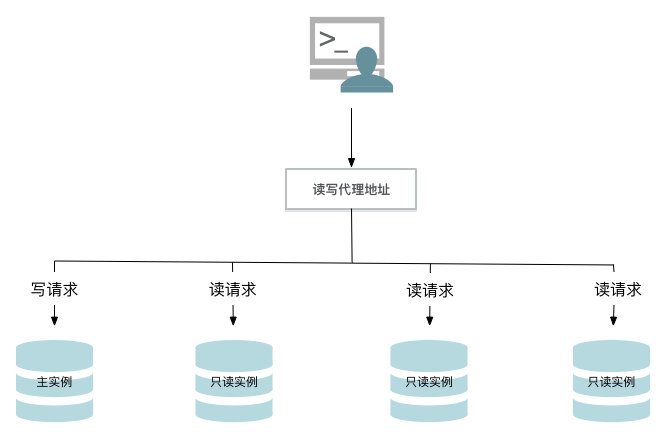
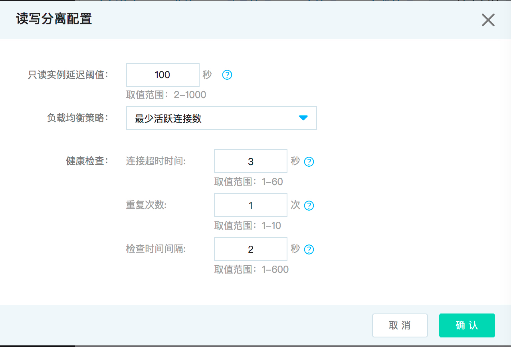

# 读写分离代理
读写分离代理是指通过代理地址（读写分离地址）实现读写请求的自动转发。数据库读写分离代理为数据库服务端和应用服务端之间的网络代理服务，用于代理应用服务端访问数据库时的所有请求，具有高可用、高性能等特点。

当您的业务有大量读请求时，单个实例可能无法满足业务需求，为了分担主库的压力，满足业务对读请求的需求，您可以[开启只读实例](https://docs.jdcloud.com/cn/rds/create-readonly-instance)；

创建只读实例成功后，您可以开启读写代理，在程序中配置读写代理的地址，由读写代理实现读请求被自动转发到只读实例，写请求被自动转发到主实例。

## 限制条件
* 单个实例只能创建一个读写代理
* 开启读写代理前必须先创建只读实例
* 目前云数据库MySQL、MariaDB、Percona支持开启读写代理

## 功能限制
* 不支持ssl

## 注意事项
* 在事务中的查询只会分配到主库
* 多语句查询只会分配到主库，如 insert into...; select last_insert_id();
* 存储过程、函数只会分配到主库
* 执行Multi-Statements只会分配到主库
* 不保证非事务读的一致性，业务上有读一致性需求可以封装到事务中
* 不支持查询语句中使用变量，将返回错误

## 操作步骤
1. 登录 [云数据库 RDS 控制台](https://rds-console.jdcloud.com/database)。
2. 点击需要开启读写代理的目标实例名称，进入到实例详情页。
3. 点击 **只读实例管理** 标签，进入只读实例管理页面
4. 点击 **读写代理** 标签，进入读写代理页面
5. 点击  **开启读写分离代理** 按钮，进入读写代理设置弹窗。
   > **注**： 如目标实例下没有只读实例，开启读写分离代理按钮置灰不能操作。您需要先[创建只读实例](https://docs.jdcloud.com/cn/rds/create-readonly-instance)。

6. 读写分离代理的界面参数说明:

|参数名称|说明|
|--|--|
|只读实例延迟阈值|&bull;可输入2-10000秒,表示只读实例和主实例最大同步时延  &bull;只读实例与主实例的延迟超过阈值后，只读实例将从读写代理后端被移除。 |
|负载均衡策略| 读写代理分发读写请求的负载均衡策略，支持最少活跃连接数、最少连接数、最小同步时延、平均响应时延 |
|连接超时时间|&bull;填写范围：1-60秒，默认为3秒 &bull;只读实例健康检查的方法。超时后只读实例将从读写代理后端被移除。|
|重复次数|&bull;填写范围：1-10，默认为1次 &bull;只读实例健康检查的方法。重试次数超过指定次数后，只读实例健康检查失败，将从读写代理后端被移除。|
|检查时间间隔|&bull;填写范围：1-600，默认为2秒 &bull;只读实例健康检查的方法，根据时间间隔对读写代理后端的只读实例进行健康检查。|

5. 点击 **确定** 按钮，提交创建读写代理的请求。

