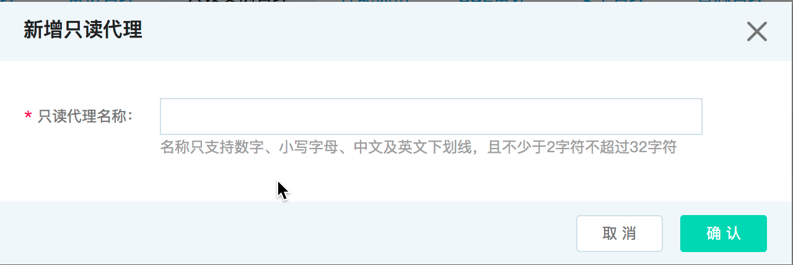
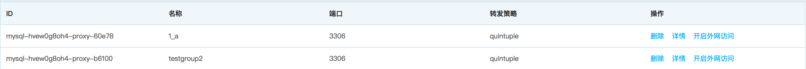

# 创建只读代理
云数据库支持用户创建一个或多个只读代理。在对数据库有少量写请求，但有大量读请求的应用场景下，您可以创建一个或多个只读实例，利用只读实例满足大量的数据库读取需求，为只读实例配置一个只读代理，提高用户数据库的读负载能力，提升业务可用性。

## 限制条件
* 适用于云数据库 MySQL/Percona/MariaDB
* 一个RDS实例最多可创建8个只读代理

## 操作步骤
1. 登录 [云数据库 RDS 控制台](https://rds-console.jdcloud.com/database)。
2. 选择需要进行添加只读代理的目标实例，点击目标实例的名称，进入到实例详情页。
3. 选择 **只读实例管理** 标签，打开只读代理管理页面，点击 **新增只读代理** 按钮，进入创建弹窗。
4. 输入只读代理名称，点击 **确定** 按钮，提交创建只读代理请求。
    
    

5. 只读代理创建完成后，在只读代理管理页面，可以查看当前RDS实例已创建的只读代理。

    