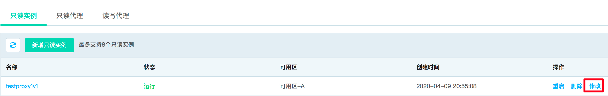

# 修改只读实例绑定的只读代理
您可以根据业务需要修改只读实例和只读代理的绑定关系，为保证负载被重新均衡，连接到只读实例的数据库请求会有一次连接瞬断，请确保应用程序能重连数据库。

## 操作步骤
1. 登录 [云数据库 RDS 控制台](https://rds-console.jdcloud.com/database)。
2. 选择需要修改只读实例与只读代理绑定关系的目标实例，点击目标实例的名称，进入到实例详情页。
3. 选择 **只读实例管理** 标签，打开只读实例管理页面，选择需要修改的只读实例，点击 **修改** 按钮。
   
4. 在 **修改只读代理** 弹窗中，为您提供了如下选择：
    * 重新选择一个只读代理；
    * 删除当前只读实例绑定的只读代理；
    
    

5. 点击 **确定** 按钮，提交修改只读代理的请求。