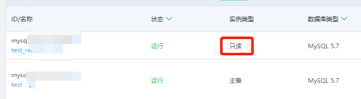
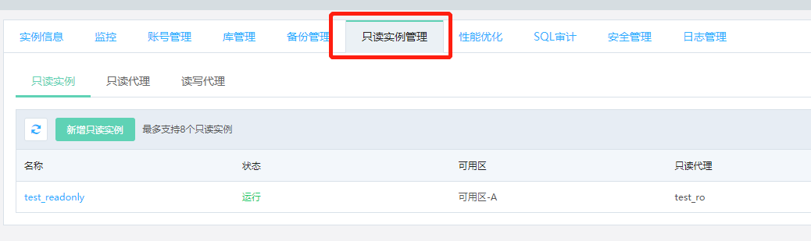

# 创建只读实例
在对数据库有少量写请求，但有大量读请求的应用场景下，单个实例可能无法抵抗读取压力，甚至对主业务产生影响。为了实现读取能力的弹性扩展，分担数据库压力，您可以在某个地域中创建一个或多个只读实例，利用只读实例满足大量的数据库读取需求，以此增加应用的吞吐量。

云数据库 MySQL/Percona/MariaDB/PostgreSQL 只读实例为单节点的架构，采用原生复制功能将主实例的更改同步到所有只读实例。

## 限制条件
* 单个实例下只读实例个数不能超过 8 个
* 只读实例所在的网络的可用 IP 数需要大于购买量
* 只读实例只支持 **按配置** 计费类型，不支持 **包年包月**

## 操作步骤
1. 登录 [云数据库 RDS 控制台](https://rds-console.jdcloud.com/database)。
2. 点击需要添加只读实例的数据库名称进入数据库详情页
3. 点击 **只读实例管理** 标签，打开只读实例管理页面
4. 点击 **新增只读实例** 按钮，进入创建只读实例页面。
5. 创建只读实例的界面参数说明  

   |参数|说明|
   |--|--|
   |地域|只读实例地域与主实例一致且不可修改|
   |可用区|可用区直接无实质性区别，关于可用区的详细说明，请参考 [地域与可用区](https://docs.jdcloud.com/cn/virtual-machines/regions-and-availabilityzones)。|
   |规格|&bull; 建议只读实例规格大于等于主实例规格  &bull; 每种规格对应cpu核数、内存、最大连接数、最大IOPS不同，详情请参见[产品规格](https://docs.jdcloud.com/cn/rds/mysql-specifications).|
   |存储空间|新建的只读实例存储空间，请确保存储空间不小于主实例，否则有可能会导致数据不一致。|
   |只读代理|选择只读实例绑定的只读代理；不选择的情况下只读实例创建后将不绑定只读代理。|
   |参数组|选择只读实例绑定的参数组，默认与主实例一致|

6. 点击 **立即购买** 按钮，进入订单确认页。
7. 勾选服务条款，点击**立即开通**，完成只读实例创建。

## 查看只读实例
在实例列表中可查看只读实例。

1. 登录 [云数据库 RDS 控制台](https://rds-console.jdcloud.com/database)。
2. 从实例列表中找到只读实例，点击该只读实例的名称

在主实例列表中查看只读实例。
1. 登录 [云数据库 RDS 控制台](https://rds-console.jdcloud.com/database)。
2. 点击需要查看只读实例的主实例，进入实例详情页
3. 切换至只读实例标签页，查看主实例关联的只读实例。

