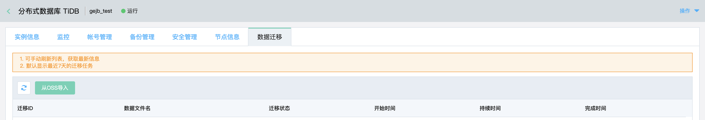
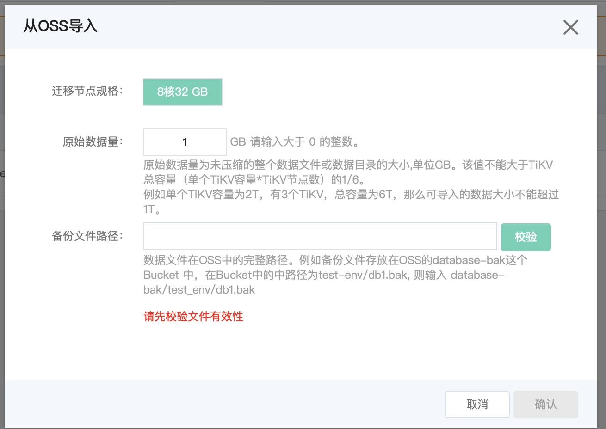
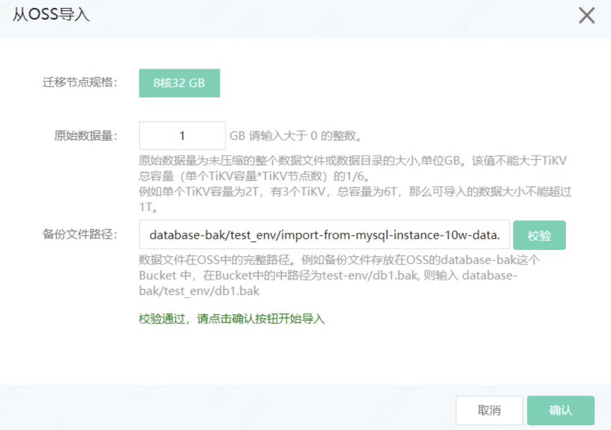

# TiDB 全量数据迁移

全量数据迁移主要分为以下3步：

1. 全量数据上传到OSS上； 
2. 设置OSS全量数据访问权限；
3. 通过TiDB控制台进行数据迁移。

步骤1、2可以参考RDS上传备份到OSS及授权的操作文档，相关连接如下：

https://docs.jdcloud.com/cn/rds/upload-backup-v2

***注意***：目前从MySQL到TiDB的全量数据迁移只支持 Mydumper导出数据或 CSV 输出格式的数据源

查看[Mydumper备份全量数据文档](../../Mydumper.md)

本文档主要介绍通过TiDB控制台进行数据迁移的操作，主要分为以下几步；

1. 登录京东云控制台，进入TiDB产品页，选择***数据迁移***功能页，点击***从OSS导入*** 功能键

2. 弹出数据导入界面，根据之前上传的OSS全量备份文件，评估原始数据量大小（**单位GB**）。

   ***注意点：***

      原始数据量为未压缩的整个数据文件或数据目录的大小,单位GB。该值不能大于TiKV总容量（单个TiKV容量*TiKV节点数）的1/6。

      例如单个TiKV容量为2T，有3个TiKV，总容量为6T，那么可导入的数据大小不能超过1T。

3. 填写备份文件在OSS中的完整路径，然后点击校验，当校验通过后，**确认**按钮高亮。

   ***例如*** 备份文件存放在OSS的database-bak这个Bucket 中，在Bucket中的中路径为test-env/db1.bak, 则输入 database-bak/test_env/db1.bak

   4.点击**确认**按钮，开始全量数据迁移，待数据迁移完成，迁移状态会变成***完成***。

  	
