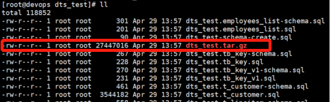
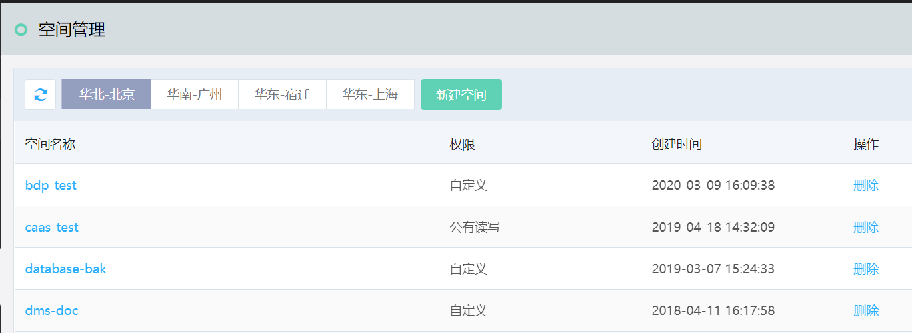
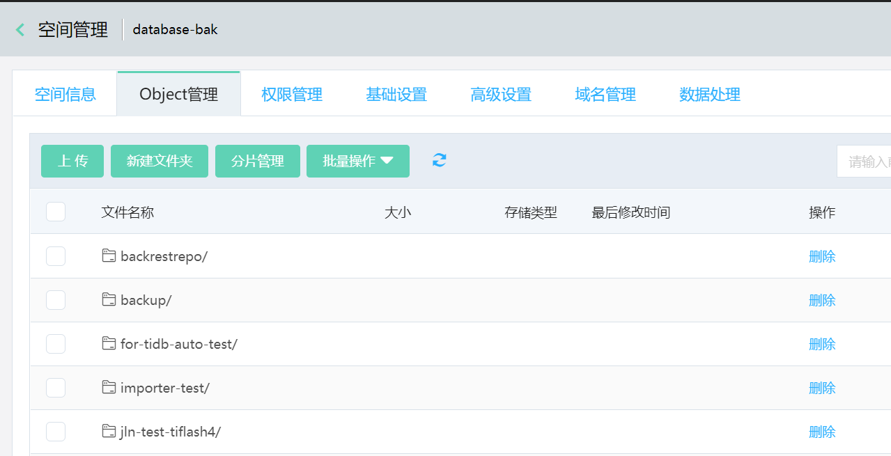
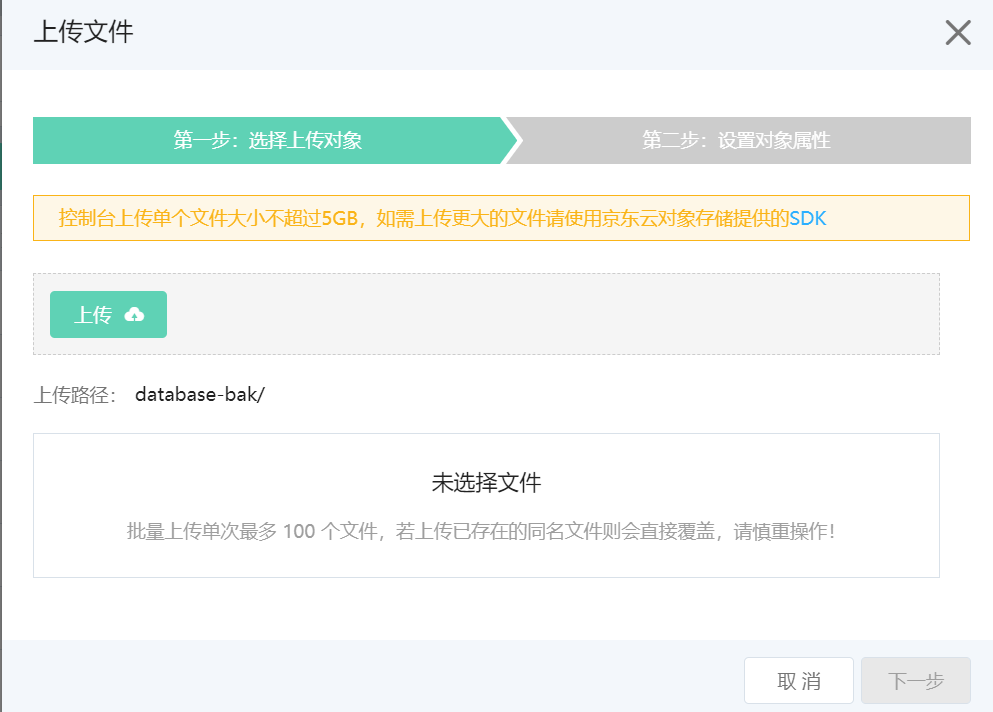
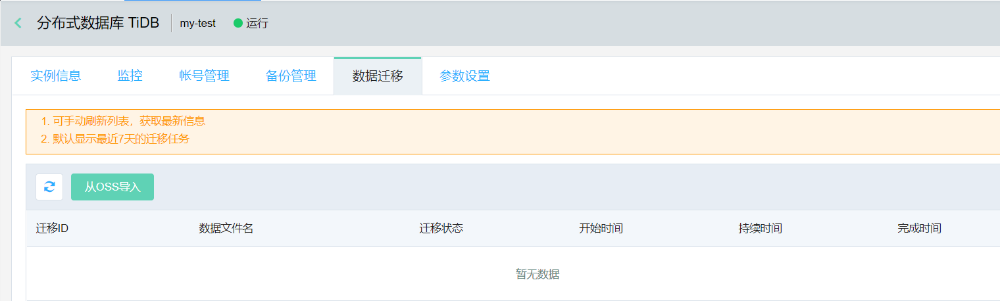
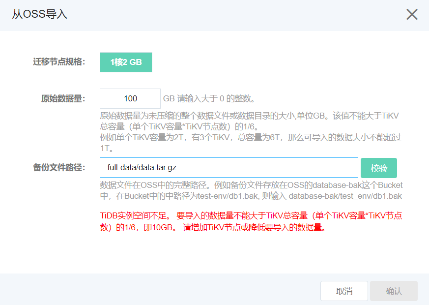
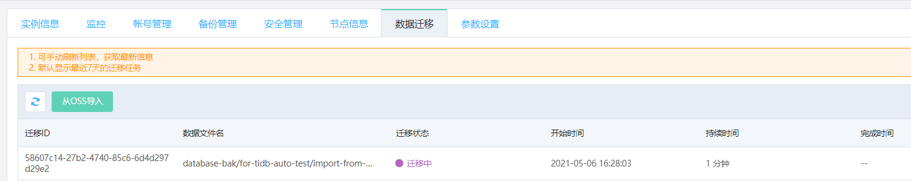

# 全量数据迁移
TiDB 控制台支持将 MySQL 的数据全量迁移到 TiDB 中，迁移步骤主要分为以下3步：
1. 对 MySQL 进行全量备份。
2. 全量备份数据上传到OSS，并设置权限。
3. 通过控制台进行全量数据迁移。

## 操作步骤
### 一. 对 MySQL 进行全量备份
1. 使用 Dumpling 工具导出MySQL的全量数据。 Dumpling相比其他MySQL的数据导出工具，性能更高。具体的使用方式和下载地址可参考 [官方帮助文档](https://docs.pingcap.com/zh/tidb/stable/dumpling-overview)。

> **注意：**
> 1. 导出文件的格式必须是sql文件。
> 2. 使用 -F 选项将单个文件的最大大小保持在 256 MiB 或以下。

2. 将导出的数据打包为 \*.tar.gz的格式，例如:
```SHELL
tar –zcvf dts.tar.gz ./*
```



### 二. 上传数据，并设置权限
将从MySQL导出的数据传入到对象存储中。

1. 进入控制台中的 **“对象存储”** ，点击 **“空间管理”**。



2. 点击空间名称，进入要上传文件的空间。



3. 选择 **Object管理** 页面，根据需要点击 **上传** 或者 **新建文件**。

> **注意：**
>
> 控制台上传单个文件大小不超过 5GB，如需上传更大的文件请使用京东云对象存储提供的 [SDK](https://docs.jdcloud.com/cn/object-storage-service/multipart-upload-s3)。



4. 然后在该空间，选择 **空间设置** ， **添加自定义权限**。


5. 设置权限
- 选择 **“自定义用户”** ，添加用户ID： **785455908940**。
- 涉及操作勾选 **“GetObject”** 和 **“ListBucket”**
- 其他保持不变
- 点击 **【确认】** 保持设置

> **注意**
> 
> 1. 785455908940 这个ID为后台系统ID，不能更改。
> 2. 不要对该Bucket中 “空间设置” 下的 “静态网站托管” 页面中的任何参数进行设置，否则可能会导致文件读取失败。


### 三. 通过控制台导入数据

1. 登录京东云控制台，进入TiDB产品页，选择 **数据迁移** 功能页，点击 **从OSS导入** 。



2. 弹出数据导入界面，根据之前上传的OSS全量备份文件，评估原始数据量大小（**单位GB**）。

> **注意：**
>
> 原始数据量为未压缩的整个数据文件或数据目录的大小,单位GB。该值不能大于TiKV总容量（单个TiKV容量*TiKV节点数）的1/6。
>
> 例如单个TiKV容量为2T，有3个TiKV，总容量为6T，那么可导入的数据大小不能超过1T。

3. 填写备份文件在OSS中的完整路径，然后点击 **校验**。当校验通过后，**确认** 按钮高亮。 例如数据文件存放在OSS的database-bak这个Bucket 中，在Bucket中的中路径为test-env/db1.bak, 则输入 database-bak/test_env/db1.bak. 然后点击 **确认** 按钮，开始全量数据迁移。



4. 在 **数据迁移** 页面中可看到迁移正在运行中。 待数据迁移完成，迁移状态会变成 **"完成"**。



  	
