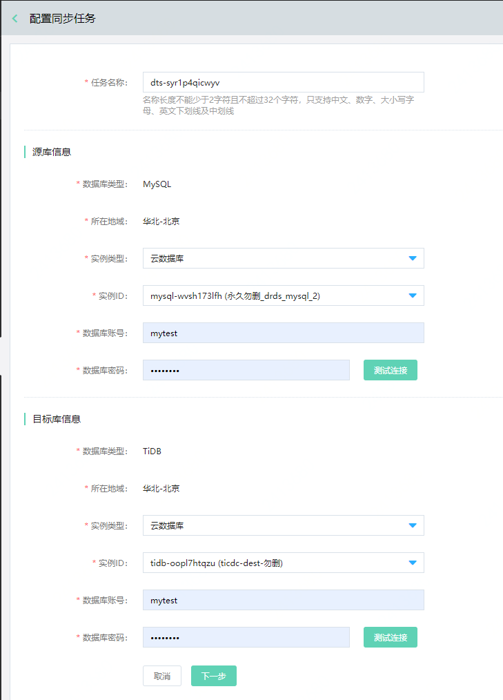
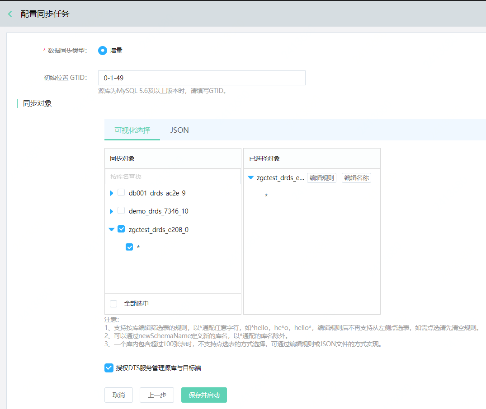

# 增量迁移
 从MySQL 到TiDB 增量迁移可以通过 DTS 的 **数据同步** 功能实现。
 
 ## 操作步骤
 1. 进入  [DTS 数据同步](https://dts-console.jdcloud.com/sync/list)，选择 TiDB 数据库所在的地域，并点击 **创建同步任务** 。 选择或输入相关配置信息，配置的参数说明如下：
- **源库**：
  - **数据库类型**: 源端的数据库类型，请选择 **MySQL**
  - **地域**：选择 MySQL 实例所在的地域。
- **目标库**：
  - **数据库类型**: 目标端的数据库类型，请选择 **TiDB**
  - **地域**：选择 TiDB 实例所在的地域。
- **链路配置**
  - **同步类型**：选择 **数据同步**
  - **同步拓扑**：选择 **单向同步**
  - **同步实例规格**：按需要同步的数据量进行选择。
  - **网络**： 建议选择 TiDB 实例所在的VPC 和子网

2. 信息输入完成后，可查看点击页面右边的概要信息，并点击 **立即购买**。
3. 成功后自动返回任务列表页面，能看到任务状态为 “创建中”。稍等一会后，显示创建完成，状态为 **未启动**。
4.  点击任务右边的 **配置同步任务**，填写相应信息。参数说明如下：
- **任务名称**：该同步任务的名称
- **实例类型**：源端或目的端的实例类型，目前支持以下两种类型：
  - **云数据库**：京东云提供的托管的数据库服务，比如RDS MySQL或者云数据库 TiDB。
  - **通过IPv6/专线/内网连接的自建数据库**：用户自建的数据库，通过各种方式打通了网络。
- **数据库账号**：连接MySQL 或者 TiDB 的账号。
- **数据库密码**：连接MySQL 或者 TiDB 的密码。

5.  填写增量相关信息，具体有：
- MySQL 初始位置 GTID
- 然后从选择要同步的表，表名支持* 通配符。点击 **编辑规则** 可编辑表的筛选规则。
- 选择完成后，勾选 **授权 DTS 服务管理源库与目标端**, 然后点击 **确认**。

> **注意**
>
>1. 支持按库编辑筛选表的规则，以 \*通配任意字符，如 \*hello，he\*o，hello\*，编辑规则后不再支持从左侧点选表，如需点选请先清空规则。
>2. 可以通过newSchemaName定义新的库名，以\*通配的库名除外。
>3. 一个库内包含超过100张表时，不支持点选表的方式选择，可通过编辑规则或JSON文件的方式实现。

