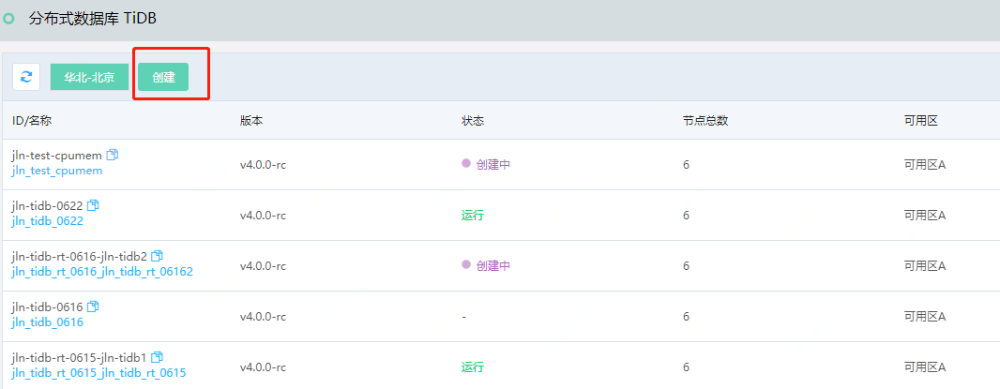
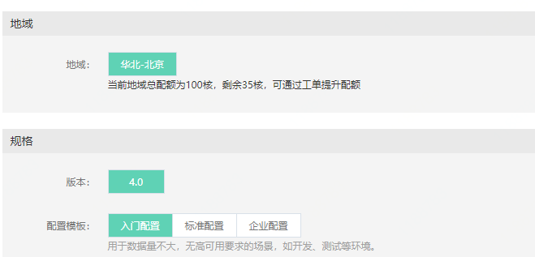
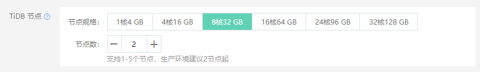
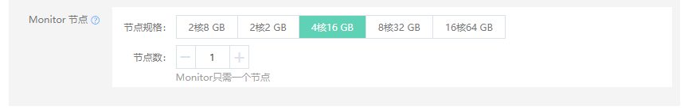
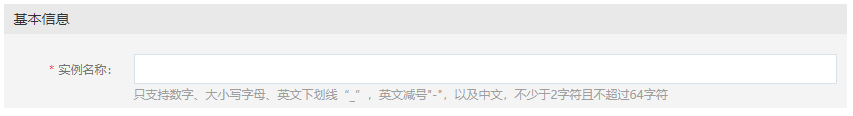

# 创建实例

您可以通过控制台快速创建分布式数据库 TiDB 实例

## 操作步骤
1. 登录 分布式数据库 TiDB 管理控制台。
2. 在实例列表页， 点击 创建 按钮，进入创建页。

3. 公测期间计费方式默认按配置计费，关于计费标准，请参考计费方式。
4. 实例配置的参数说明如下：
- **地域**：选择实例所在的地域，不同地域资源的内网不互通，创建后不能更改。关于地域的详细说明，请参考 地域与可用区。
- **版本**：指的是数据库类型的版本，具体以控制台为准。
- **配置模板**: 根据绝大多数的应用场景定义好的适合不同规模的TiDB的模板，用户可以直接使用模板的配置，也可在模板的基础上自行调整。

- TiDB 节点
  - 功能：负责接收请求，处理SQL逻辑，与TiKV交互获取数据，并最终返回处理结果。TiDB 节点不存储数据。 
  - 节点数：支持1-5个节点，生产环境建议2节点起

- TiKV 节点
  - 功能：TiKV 节点是Key-Value分布式存储引擎，用于存储用户数据
  - 节点数：公测期间支持3-16个节点，节点数跟数据规模相关，3节点起，后续可支持更多节点数，具体可参考控制台上的详细信息。
  - 备注：TiKV为3副本，因此同样的数据量需要3倍的存储空间。当前可实际存储的数据量为300 GB。

- PD 节点
  - 功能：PD节点是整个集群的管理模块，主要负责存储集群的元信息，对 TiKV 进行调度和负载均衡，分配事务 ID。
  - 节点数：生产环境建议3个节点起，支持1、3、5个节点，后续可支持更多节点数，具体可参考控制台上的详细信息。
  

- Monitor 节点
  - 功能：负责监控数据的管理，
  - 节点数：一个集群只有一个Monitor节点

- 网络：选择要创建实例的VPC和子网。 注意子网需要有足够的IP，所需IP数为 TiDB 节点数 + 5.

- 可用区：选择要创建实例的可用区，目前暂时仅支持单可用区部署

- 实例名称：输入要创建实例的名称，名称的规则可参考控制台上的描述

5. 点击 立即购买 进入订单确认页。 

6. 阅读并勾选《分布式数据库 TiDB 使用服务条款》，按照提示完成后续操作。 
