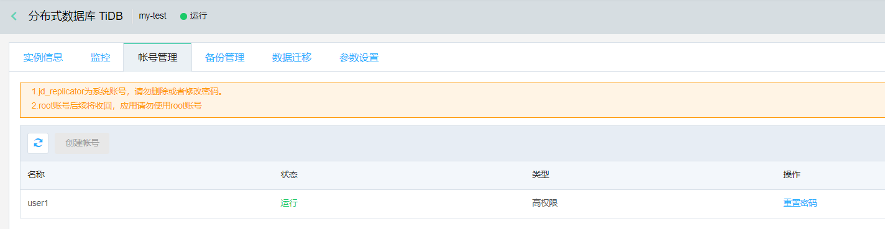

# 创建账号
在使用数据库之前，需要在 TiDB 实例中创建账号。 

> **注意：**
> 1. 通过控制台创建的为高权限的管理账号，可以通过这个账号使用SQL创建其他应用的账号并进行授权。
> 2. 每个 TiDB 实例只允许有一个高权限的管理账号。
> 3. 高权限账号创建后不允许删除，只能重置密码。

## 操作步骤 
1. 登录云数据库 RDS 控制台。
2. 选择需要创建账号的目标实例，点击目标实例，进入 **实例详情**。
3. 选择 **账号管理** 标签，打开账号管理页面，点击 **创建账号** 按钮。

4. 在创建账号弹出框中输入相应的信息，参数说明如下:
- 数据库账号、密码：数据库账号我们保留了一些关键字名称，并且账号密码的长度和字符有一定限制，具体以控制台为准。

4. 单击 **确定** 按钮，创建账号成功，返回到账号管理页面。

