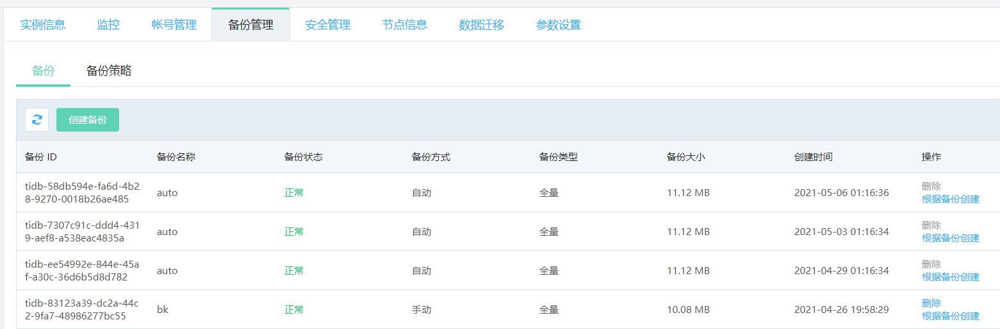
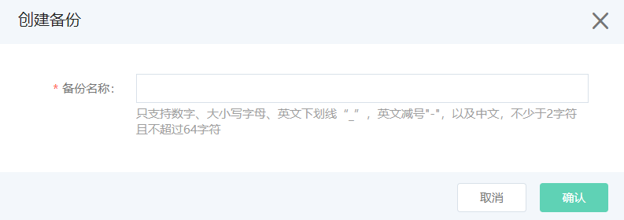

# 创建备份
TiDB 实例支持自动备份和手动备份两种方式，目前备份暂时不收取费用。
- 自动备份：可通过修改备份策略来设置自动备份触发的时间点，具体操作请参考 [设置备份策略](Modify-Backup-Strategy.md)。备份文件会存放在京东云的云存储服务上，自动备份默认保存7天，不允许删除。
- 手动备份：用户通过控制台或者OpenAPI发起的备份。系统不会删除用户手动发起的备份，只能用户自己删除。 **默认每个实例可以创建3个手动备份**。

## 操作步骤 
1. 点击实例名，进入实例页面，选择 **备份管理** 页面，点击 **创建备份** 。

2. 根据控制台上的提示信息，输入 **备份名称**，然后点击 **确定** 开始创建备份。

