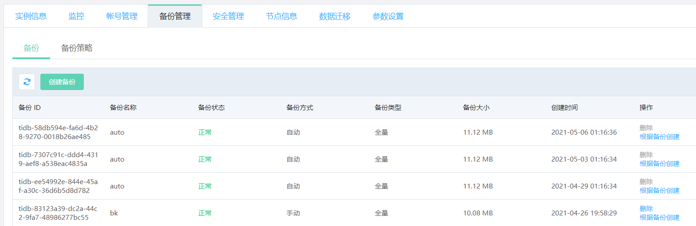
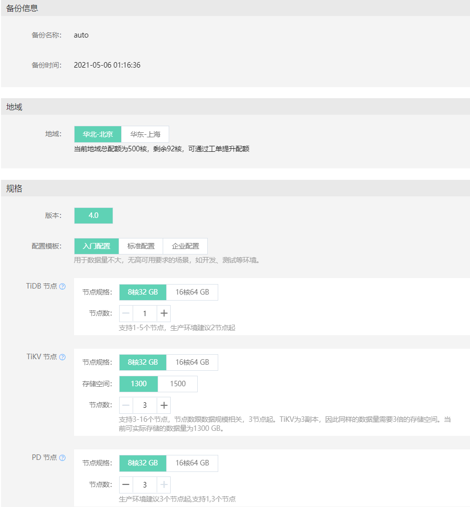
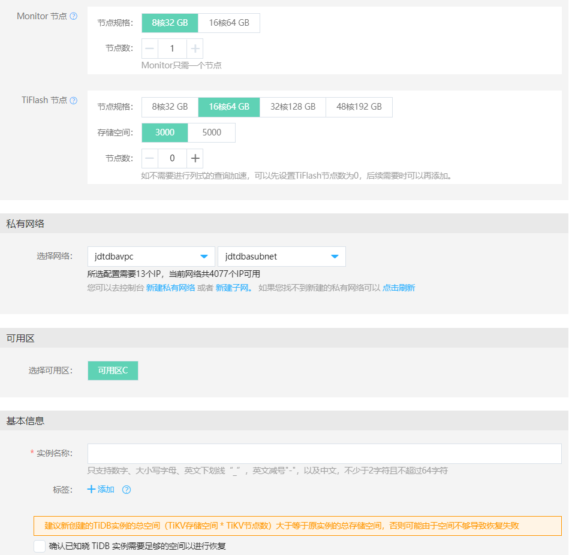

# 根据备份创建
当实例发生问题需要恢复时，可以使用 “根据备份创建” 的方式，根据备份新创建一个实例，然后进行跟原有实例进行数据校验，确认恢复的数据正确无误。 

> **注意：**
>
> 使用“根据备份创建”时，建议新建实例的存储空间 >= 原实例的存储空间，以避免由于空间不足导致创建失败。

## 操作步骤
1. 进入实例详情中的备份管理页面，在所选备份的右边点击 **根据备份创建**。

2. 在弹出的页面中可看到选择的备份名称，备份创建时间及地域信息，勾选 **“确认已知晓 TiDB 实例需要足够的空间进行恢复”** ，然后点击 **立即购买**。

新创建实例的具体步骤可参考[创建实例](../Instance/Create-Instance.md)

