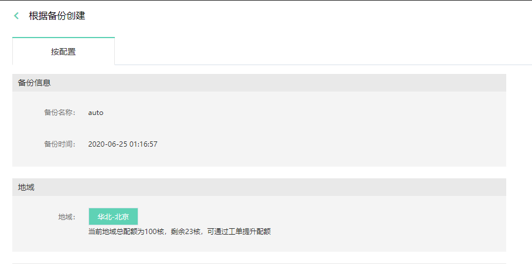

# 根据备份创建
当实例发生问题需要恢复时，可以使用 “根据备份创建” 的方式，新创建一个实例，然后进行跟原有实例进行数据校验，确认恢复的数据正确无误。 

> 注意： 使用“根据备份创建”时，建议新建实例的存储空间 >= 原实例的存储空间，以避免由于空间不足导致创建失败。

## 操作步骤
#### 1. 进入备份管理页面  
进入实例详情中的备份管理页面，在所选备份的右边点击 “根据备份创建”

#### 2. 输入新实例的相关信息
在弹出的页面中可看到选择的备份名称，备份创建时间及地域信息。

选择新创建实例的规格，VPC可用区及实例名称等信息，具体步骤可参考[创建实例](../Instance/Create-Instance.md)
