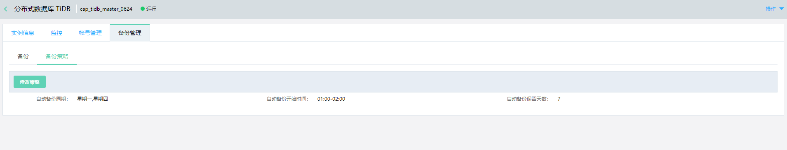
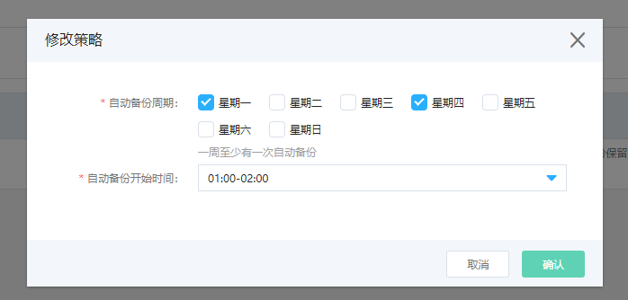

# 设置备份策略

TiDB 可根据设置，定期进行自动的全量备份。 在控制台上可对自动备份设置备份策略，包括：
- 备份周期：设置自动备份每周的那几天进行备份，建议每周至少进行一次全量备份。
- 备份开始时间：设置自动备份开始的时间范围，系统将尽量保证备份在选择的时间范围内开始，但不保证备份在该时间范围内完成。 如果数据量较大，备份可能会持续若干小时。

> **注意：**
> 
> 由于备份时会占用IO资源，因此建议备份放在业务量较低的时间内。

## 操作步骤
1. 点击实例名，进入实例页面，选择 **备份管理--> 备份策略** 页面，点击 **修改策略**。

2. 设置备份策略
- 选择要进行自动备份的周期。
- 选择自动备份的开始时间。
- 点击 **确认**。

