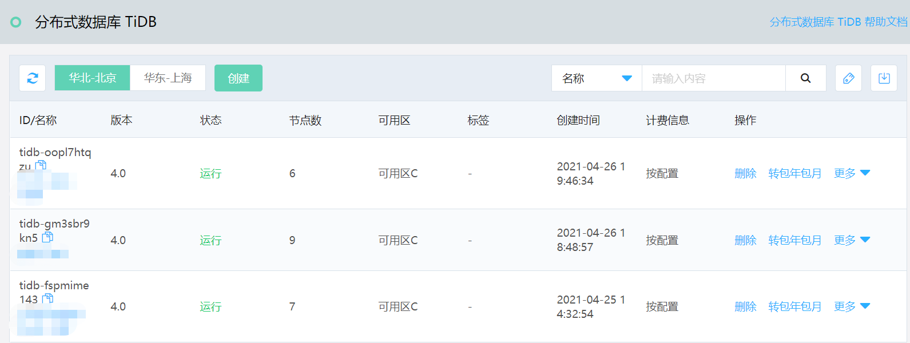
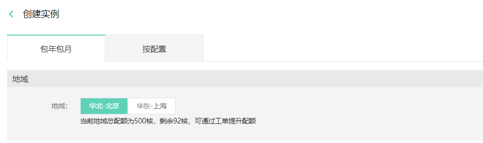
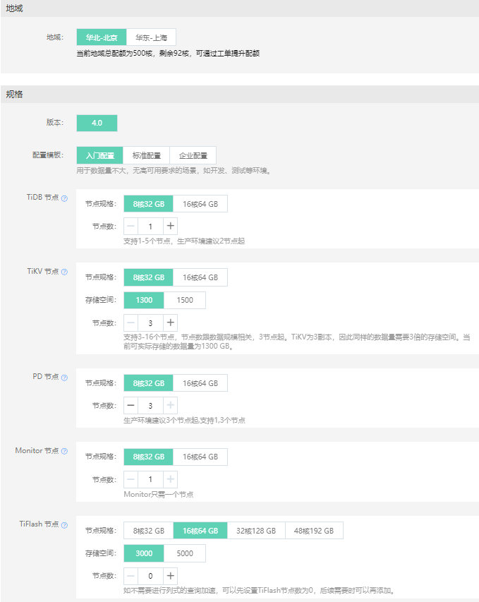
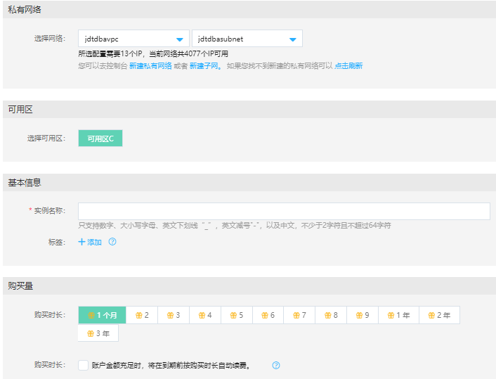
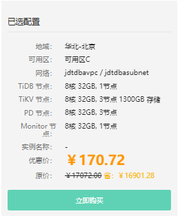

# 创建实例
可以通过控制台快速创建分布式数据库 TiDB 实例。

## 操作步骤
1. 登录 分布式数据库 TiDB 管理控制台。
2. 在实例列表页， 点击 **创建** 按钮，进入创建页。

3. 选择或输入实例的相关配置信息，实例配置的参数说明如下：
- **地域**：选择实例所在的地域，不同地域资源的内网不互通，创建后不能更改。
- **版本**：TiDB 数据库的版本，具体支持的版本以控制台为准。
- **配置模板**: 满足绝大多数的应用场景，适合不同规模的TiDB的配置模板，用户可以直接使用模板的配置，也可在模板的基础上自行调整。
- **TiDB** 节点
  - 功能：负责接收请求，处理SQL逻辑，与TiKV交互获取数据，并最终返回处理结果。TiDB 节点不存储数据。 
  - 节点数：生产环境建议2节点起。
- **TiKV** 节点
  - 功能：TiKV 节点是Key-Value分布式存储引擎，用于存储用户数据。
  - 节点数：节点数跟数据规模相关，3节点起，具体可参考控制台上的详细信息。
  - 备注：TiKV为3副本，因此需要3倍的存储空间。
- **PD** 节点
  - 功能：PD节点是整个集群的管理模块，主要负责存储集群的元信息，对 TiKV 进行调度和负载均衡，分配事务 ID。
  - 节点数：生产环境建议3个节点起，具体可参考控制台上的详细信息。
- **Monitor** 节点
  - 功能：负责监控数据的管理。
  - 节点数：一个集群只需要一个Monitor节点。
- **TiFlash** 节点 （可选）
  - 功能：数据的列式存储，用于数据分析类的查询加速。
  - 节点数：可以按需创建。 如果无数据分析的业务，可以不使用TiFlash。

- **网络**：选择要创建实例的VPC和子网。 注意子网需要有足够的IP，所需IP数为 TiDB 实例总节点数 + 5。当该 VPC 支持IPV6时，创建的数据库实例也自动支持 IPV6。
- **可用区**：选择要创建实例的可用区，目前仅支持单可用区部署。
- **实例名称**：输入要创建实例的名称，名称的规则可参考控制台上的描述。
- **标签**（可选）：对实例打上相应的标签（tag），方便进行管理。

如果是包年包月，还会显示
- **购买时长**：选择需要购买的时长。
- **自动续费**（可选）：当账户金额充足时，在实例到期前是否自动续费。

4. 信息输入完成后，可查看点击页面右边的概要信息，并点击 **立即购买**。

6. 阅读并勾选《分布式数据库 TiDB 使用服务条款》，按照提示完成后续操作。 
7. 成功后自动返回实例列表页面，能看到实例状态为 “创建中”。稍等一会后，点击刷新按钮，手工刷新页面，显示实例创建完成，正常 “运行”中。
