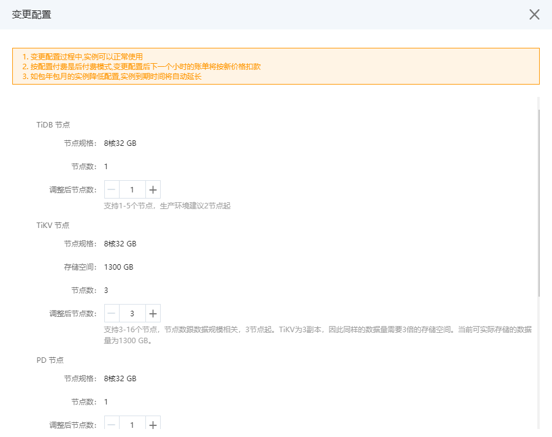
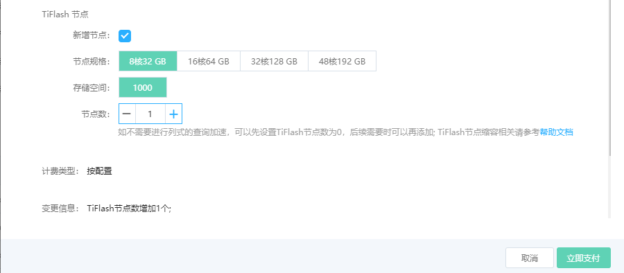

# 变更配置
可以根据业务量的变化，调整 TiDB 实例各类节点的数目，从而提升实例整体的处理能力，数据容量或降低实例的使用成本。 

在变更配置过程中，TiDB 实例可正常使用。

> **注意**
> - 只有实例状态为 “运行” 时，才能进行变更配置的操作。
> - 只支持修改各类节点的数目，暂不支持修改 CPU 核数，内存或存储空间等属性。
> - TiFlash 节点如果在创建时没有创建，可以通变更配置添加。

## 前提条件
TiFlash 节点缩容时，需要对所有副本数大于集群剩余 TiFlash 节点数的表执行如下命令：

1. 将 TiFlash 中表的副本数设置为0。
```shell
alter table <db-name>.<table-name> set tiflash replica 0;
```

2. 查看表的副本数。
```shell
SELECT * FROM information_schema.tiflash_replica WHERE TABLE_SCHEMA = '<db_name>' and TABLE_NAME = '<table_name>';
  ```
只有查询不到副本数，才可对 TiFlash 节点进行缩容，否则缩容操作无法正常进行。

## 操作步骤

1. 登录 分布式数据库 TiDB 管理控制台。

2. 水平扩容的入口有两个，分别为：
   - 实例列表：右侧，点击 **变更配置**。
   - 实例详情页：选择需要扩容的目标实例，进入到实例详情页，点击页面右上角的 **变更配置**。
   - 实例详情页：实例详情页，配置选项栏，点击 **变更配置**。

3. 在变更配置弹框中，调整各类节点的数目。 当实例没有TiFlash节点需要新加时, 可以选择 TiFlash 节点的规格和存错；当创建实例已经创建TiFlash，只能调整 TiFlash 节点的数目。




