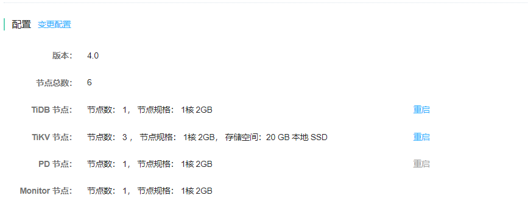

# 重启节点
可以重启 TiDB 实例中各类节点。 重启是每次一个节点轮流重启。比如 TiDB 实例中有3个 tidb 节点，重启时集群中有2个 tidb 节点，因此集群仍可提供服务，但性能会略受影响，因此建议在维护时间窗口中进行重启节点操作。

> **注意：**
>
> 如果某类节点的数目只有1个，则该类节点不允许重启。

## 操作步骤
1. 进入实例详情页面，可看到 **配置** 部分下，各类节点右边有重启按钮。 

2. 点击 **重启** 按钮，并且弹出的对话框中点击 **确认**。

