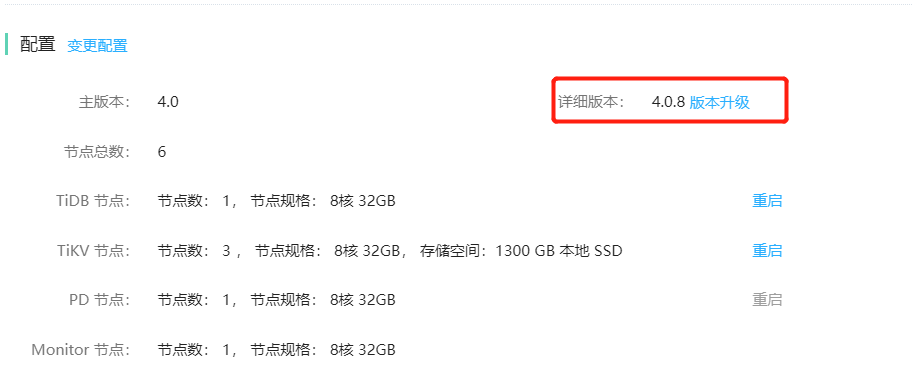
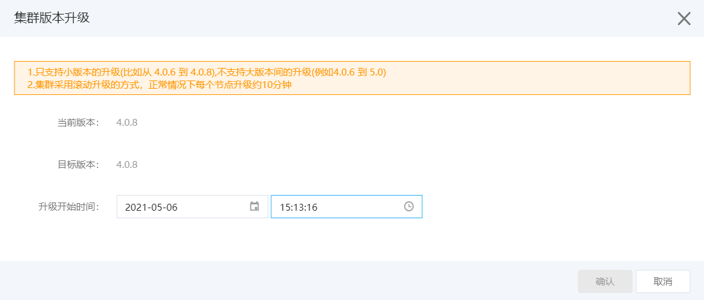

# 数据库版本升级
可进行TiDB 数据库的小版本的升级，例如从4.0.6 升级到4.0.8。 暂不支持大版本的升级，例如从4.0.6升级到5.0。

## 操作步骤
1. 进入实例详情页面，可看到 **配置** 部分下，在“详细版本”后有 **版本升级** 按钮。

2. 点击  **版本升级** ，在弹窗中选择计划升级的开始时间。 默认为当前时间，立即升级。

> **注意：**
>
> 1. 只支持小版本的升级(比如从 4.0.6 到 4.0.8),不支持大版本间的升级(例如4.0.6 到 5.0)。
> 2. 集群采用滚动升级的方式，正常情况下每个节点升级约10分钟。

