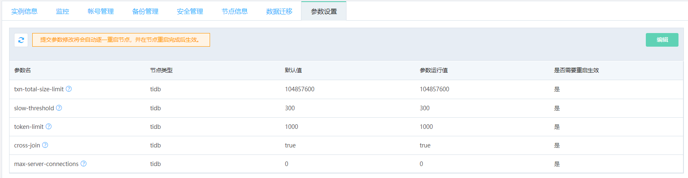

# 参数设置

可以通过控制台修改 TiDB 实例的部分参数。

> **注意：**
>
> 修改参数需要重启节点，对业务有轻微影响，建议在业务低峰期进行修改操作。 比如 TiDB 实例中有两个 tidb 节点，修改了 tidb 节点相关参数后，2个TiDB 节点会依次轮流重启，以确保服务不会中断。但重启期间，由原先2个 TiDB 节点提供服务变为1个 TiDB 节点，对性能有会有影响。

## 操作步骤
1. 进入实例页面，选择 **参数设置**，点击**编辑** 。
2. 在 **参数运行值** 一列中修改参数，修改完成后点击 **提交修改**。

