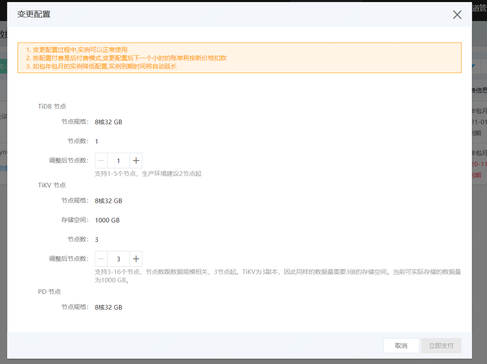

# 水平扩容

根据您的业务变化，您可以手动修改tidb实例各组件服务节点数。

## 注意事项

- 只有实例状态为 运行，且不欠费状态，才能进行水平扩容操作。

- tidb，pd，tikv节点只支持修改节点数，CPU核数和内存等属性暂不支持修改

- tiflash节点在创建时没有创建，可以通过水平扩容创建服务节点。

- tiflash节点缩容时，需要对所有副本数大于集群剩余 TiFlash Pod 数的表执行如下命令：

  1. 将tilfash中表的副本数设置为0

     ```shell
     alter table <db-name>.<table-name> set tiflash replica 0;
     ```

  2. 查看表的副本数

     ```shell
     SELECT * FROM information_schema.tiflash_replica WHERE TABLE_SCHEMA = '<db_name>' and TABLE_NAME = '<table_name>';
     ```

     只有查询不到副本数，才可对tiflash节点进行缩容，否则缩容操作无法正常进行。

## 操作步骤

1. 登录 分布式数据库 TiDB 管理控制台。

2. 水平扩容的入口有两个，分别为：

   - 实例列表：右侧，点击 变更配置 -> 水平扩容。
   - 实例详情页：选择需要扩容的目标实例，进入到实例详情页，点击页面右上角的 变更配置 ->水平扩容。
   - 实例详情页：实例详情页，配置选项栏，点击变更配置-> 水平扩容。

3. 配置变更弹框，当创建实例时没有创建TiFlash节点, 可以选择规格和存错，当创建实例创建了tiflash，只能调节节点数。

   

