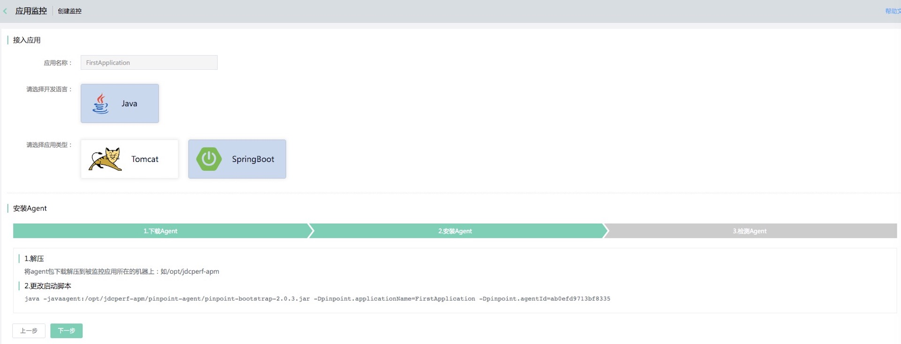
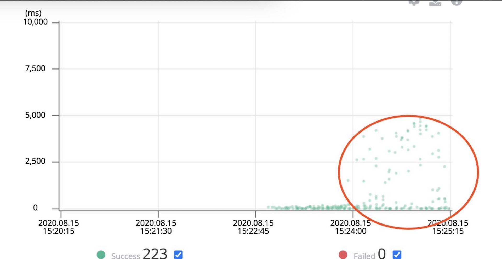
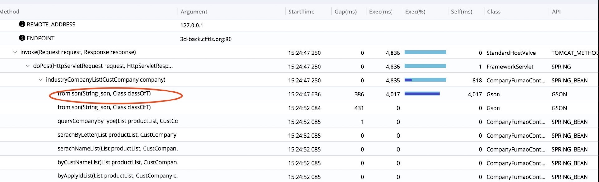

# 应用监控
## 应用监控-创建监控
### 操作步骤
1. 点击左侧导航栏的应用监控进入应用监控列表页。
2. 点击创建监控，进入创建监控页。
3. 填写应用名称，选择开发语言（目前仅支持java）和应用类型后点击保存。
4. 按照界面的操作说明进行安装agent的操作，安装agent到应用所在的机器上（应用所在机器需要公网访问权限）并重启应用成功后，检测agent状态，如平台检测agent安装成功即可对应用性能进行监控了。

5. 在应用监控列表页点击详情即可进入应用的性能监控详情页面，页面展示了当前时间段内请求的概要信息，包含成功/失败、响应时间。

6. 鼠标左键拖动来选中希望深入查看的请求点，进入请求耗时详情页面，通过选中具体的某一个请求来深入分析耗时原因，定位性能瓶颈。

