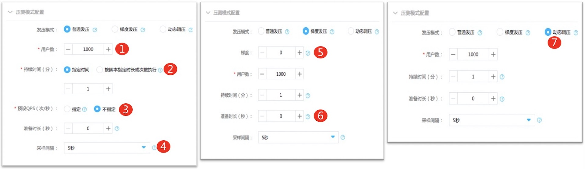
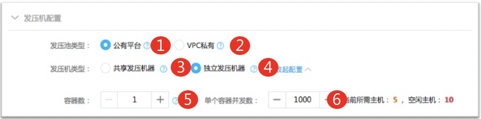
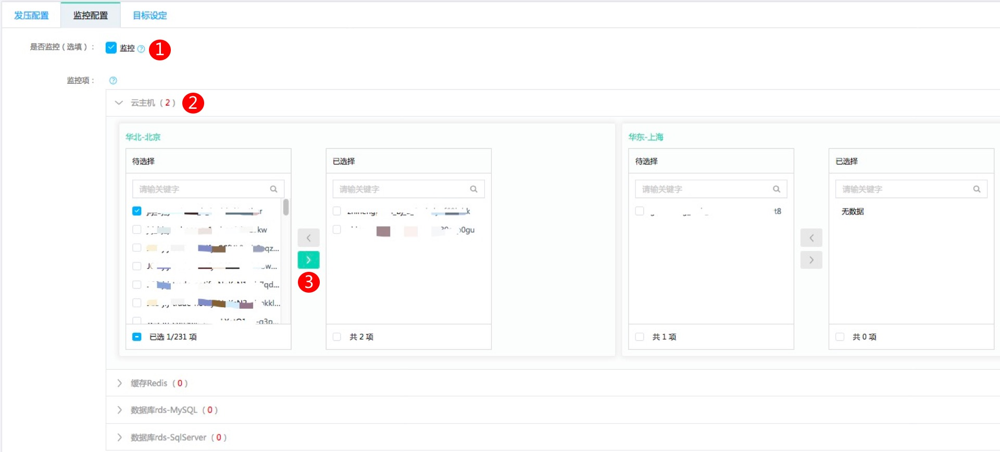

# 脚本执行
## 脚本执行-发压配置
### 操作步骤
1. 在测试脚本列表页，点击操作栏处的【执行】进入执行配置页面。
2. 切换至发压配置Tab页，首先完成压测模式配置，压测模式分为三种，按照如下方式完成发压模式的设置。

|序号|填写项|内容|
|---|---|---|
|1|用户数|压测时使用的并发用户数|
|2|持续时间|压测持续的预设时间，单位为分钟。测试过程中可随时取消测试任务|
|3|预设QPS|压测时会把压力控制在预设的QPS数值，实际QPS受用户数和被测服务影响不一定能达到此值。仅适用于普通发压|
|4|采样间隔|实时性能指标展示的粒度，即QPS、响应时间等每隔多长时间展示一个数值点|
|5|梯度|梯度发压指用户(并发)数会在准备时间内，按照梯度数逐步增长，此处设置梯度个数 例如希望梯度为1000-2000-3000，此处可以设置为3。填写项1中的用户数设置为3000|
|6|准备时长|在多长时间内把所有用户数加载完成，普通发压和动态调压模式是均匀线性增加到设置的并发用户数。 梯度发压时会按照梯度个数进行梯度加载，比如用户数设置为3000，梯度个数为3，准备时长为30分钟，那么初始并发数为1000，持续10分钟后增加到2000并发，再持续10分钟增加到3000，3000也会持续压测10分钟，之后会继续保持填写项2中设置的持续时间后结束任务|
|7|动态调压|选择动态调压后，在发压过程中，可以手动调节用户(并发)数|

3. 在发压配置Tab页按照如下方式完成发压机配置的设置。

|序号|填写项|内容|
|---|---|---|
|1|公有平台|平台提供的公共发压资源，目前为京东云华北区挂载了弹性公网IP的可弹性扩缩容的云主机|
|2|VPC私有|用户自行提供压力机，注册到本压测平台上的压力机池，详情请参考VPC发压机池章节|
|3|共享发压机器|压测平台按照系统默认配置，根据用户设定的并发用户数启动1台或者多台压力机进行发压|
|4|独立发压机器|根据自定义的容器数和单个容器并发数启动对应数量的压力机进行发压|
|5|容器数|单台压力机启动的容器个数，可以理解为启动的jmeter进程数|
|6|单个容器并发数|单个容器（jmeter进程）可以启动的最大并发用户数（线程数） 容器数\*单个容器并发数为单个压力机支持的最大并发数，计算公式：当前所需主机数=步骤2中设置的并发用户数/（容器数\*单个容器并发数）|

4. 在发压配置Tab页设置运行时参数，此处为脚本中的User Defined Variables设置的内容，编辑并保存后可以生效。

## 脚本执行-监控配置
### 操作步骤
1. 切换至监控配置Tab页，目前仅支持对当前账号下的京东云上资源进行关键性能指标的监控，包括云主机、负载均衡、云缓存Redis和云数据库RDS。
2. 在监控配置Tab页按照如下方式完成监控相关设置。

|序号|填写项|内容|
|---|---|---|
|1|监控|如果需要在压测过程中实时展示以及报告中体现云上资源的关键性能指标，请选中此项|
|2|待监控云资源|点击待监控资源项的左侧箭头标志，会自动加载当前账号下的所有云上资源，如果要使用子账号，只要保证子账号有控制台登录权限即可，其他权限非必须|
|3|选择/取消选择|通过选择/取消选择按钮来选择/取消选择待监控的云资源|

## 脚本执行-目标设定
### 操作步骤
1. 切换至目标设定Tab页，目前仅支持对平均QPS的目标值进行自定义设置，其他目标为平台默认值，此处设置的目标在测试报告中会给出各项指标通过/不通过的结论。
2. 在目标设定Tab页设定目标平均QPS。

## 脚本执行-执行
### 操作步骤
1. 按照测试需求完成发压配置、监控配置和目标设定Tab页的相关设置后，点击执行即可进入压测执行状态。