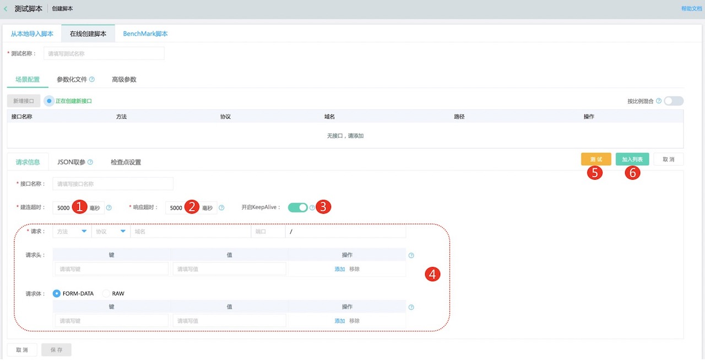
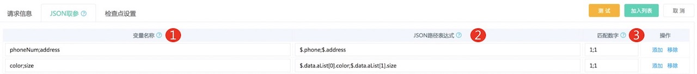
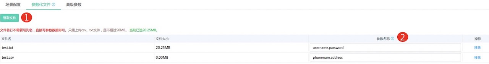

# 脚本创建
创建性能测试脚本是使用京东云性能测试服务的第一步，本文将帮助您了解性能测试脚本的一些背景知识，以及如何创建一个性能测试脚本。
## 性能测试脚本
要发起一次性能压测，首先要创建一个性能测试脚本，性能测试服务支持在线创建性能测试脚本；同时也支持直接导入在线下调试通过的jmeter脚本和相关参数化文件、插件。
- 在线创建测试脚本：支持http/https请求、JSON取参、检查点；支持参数化文件、域名绑定、自定义变量；支持混合场景的比例设置。
- jmeter脚本导入：如果在线创建脚本无法满足测试需求，比如需要测试非http/https协议，对其他jmeter组件有需求等，可以在线下完成jmeter脚本的创建和调试工作，然后把jmx和参数化文件等一起上传到性能测试平台。

## 在线创建测试脚本
### 操作步骤
1. 登录性能测试控制台，在左侧导航栏单击测试脚本，点击创建脚本，选择在线创建脚本Tab页。
2. 填写测试名称，如某系统/接口618大促压测。
3. 点击新增接口，填写接口名称后按照如下说明完成单个接口请求信息的填写。

|序号|填写项|说明|
|---|---|---|
|1|建连超时|连接超时，等待连接打开的毫秒数|
|2|响应超时|响应超时，等待响应的毫秒数|
|3|开启KeepAlive|开启后该接口会设置请求头：Connection: keep-alive，即使用长连接|
|4|请求信息|填写被测接口的具体信息|
|5|测试|根据当前填写的实际值进行接口验证，验证时暂不支持参数化、断言、jmeter自定义函数等|
|6|加入列表|当前接口设置完成后，点击加入待保存列表|
4. JSON取参设置（同jmeter的JSON Extractor），按照如下说明完成JSON取参的相关设置。

|序号|填写项|说明|
|---|---|---|
|1|变量名称|分号分隔，包含JSON路径表达式的结果（必须匹配JSON路径表达式的数量）|
|2|JSON路径表达式|分号分隔，JSON路径表达式（必须匹配变量数量）|
|3|匹配数字|0-随机、N-提取第N个结果、-1-提取所有结果，它们将被命名为：<参数名>_N（其中N为1~结果数）  如未匹配到，此变量会被设置为NOT FOUND|
5. 检查点设置（同jmeter的Response Assertion），按照如下说明完成检查点的设置，如添加多个检查点，实际结果全部匹配才会判断为检查成功。

|序号|填写项|说明|
|---|---|---|
|1|检查点类型|目前支持响应状态码和响应文本|
|2|匹配规则|匹配、包含、相等|
|3|匹配内容|要匹配的状态码或者响应文本的内容|

6. 通过步骤3-5可以完成单个接口相关信息的配置，可添加多个接口至测试脚本中。后续步骤讲解参数化文件和高级参数的使用。
7. 参数化文件（同jmeter的CSV Data Set Config），按照如下说明完成参数化文件的相关设置。

|序号|填写项|说明|
|---|---|---|
|1|选取文件|仅支持csv和txt文件。顺序读取文件中的行，并根据以逗号分隔的参数名称进行分割，总大小不能超过50MB 请确保文件中每一行的列数相同且均以逗号为分隔符|
|2|参数名称|逗号分隔的1个或者多个参数名称，在“场景配置-请求信息”中的任何地方使用${参数名称}进行引用。|

8. 高级参数，目前包含域名绑定（同jmeter DNS Cache Manager）和自定义变量（同jmeter User Defined Variables），相关说明如下。

|序号|填写项|说明|
|---|---|---|
|1|是否绑定|已经加入到列表中的请求包含的域名会自动在此处展示，按照需要选择是否绑定|
|2|域名或IP|已选择绑定的域名要解析到的域名或者IP|
|3|自定义变量|自定义参数名称和参数值，在此自定义的参数名称可以在“场景配置-请求信息”中以${参数名称}进行引用，且在执行页面的“运行时参数”处修改值，避免编辑和更新脚本|

9. 按比例混合，当有多个url加入列表后，此项如果不勾选，单个并发用户会顺序、循环执行这些url，为了模拟真实业务场景的比例，可以勾选后设置访问百分比，确保所有url的百分比相加为100%。

## 从本地导入脚本
### 操作步骤
1. 本地下载安装JMETER，通过JMeter编写和调试自己的脚本。 （请使用最近的JMeter 5.0版本，避免脚本版本不兼容带来的问题。安装使用很简单，网上有大量的教程可参考）。
2. 脚本调试通过后，把jmx文件、csv文件、txt文件根据如下说明上传到平台。

|序号|填写项|说明|
|---|---|---|
|1|选取文件|选取本地的jmx文件（必须有且只能有1个）、csv文件和txt文件（参数化使用，可以有多个）|
|2|创建|根据上传的文件生成性能测试脚本|
备注：如果有第三方或者自定义插件jar包，务必通过平台左侧导航栏的插件管理上传，上传后本账号下所有脚本共享使用。

## Benchmark脚本
### 操作步骤
1. Benchark脚本为调度开源专项测试工具对被测对象展开性能测试，目前支持redis-benchmark和esrally。
2. 目前Benchmark压测仅支持vpc内发压，需要定制压测机镜像，有需求请提工单咨询。

## 脚本列表页
### 操作步骤
1. 创建脚本成功后会自动跳转到脚本列表页，在左侧导航栏单击测试脚本同样可以进入测试脚本列表页。
2. 脚本列表页的各数据项和各操作说明如下。

|序号|数据/操作项|说明|
|---|---|---|
|1|创建脚本|点击后进入创建脚本页面，可直接在线创建脚本，也可以本地使用jmeter调试通过后直接上传至平台|
|2|创建文件夹|如测试脚本较多，可以通过创建文件夹来组织和管理脚本|
|3|ID|测试脚本的ID|
|4|名称|测试脚本的名称|
|5|创建时间|测试脚本的创建时间|
|6|更新时间|测试脚本最近一次更新的时间，更新包括脚本创建、脚本更新和脚本执行操作|
|7|最新执行状态|脚本最新一次的执行状态|
|8|操作|适用于此脚本的操作列表|
|9|执行|使用此脚本执行压测|
|10|执行历史|此脚本的所有执行历史记录|
|11|编辑|编辑此脚本，如果是在线创建的，点击编辑后支持在线界面编辑；如果是本地上传的，会直接展示jmx原始文件，支持直接编辑|
|12|移动|移动此脚本到预期的文件夹内，前提是已经创建了文件夹|
|13|更多-创建定时|使用此脚本创建定时任务|
|14|更多-下载脚本|下载此脚本，如果有参数化文件，会以zip包的形式和jmx脚本一起下载|
|15|更多-删除脚本|删除此脚本|
