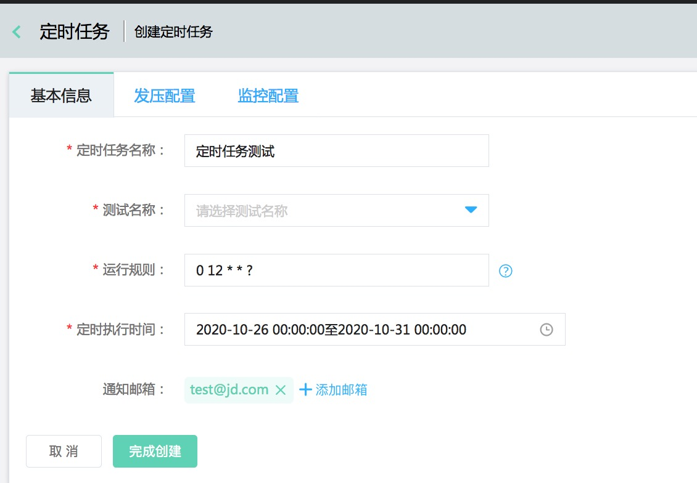

# 定时任务
## 页面构造定时任务
可选择脚本并根据cron表达式来创建定时任务，以达到定时压测的目的，请参考如下说明进行创建。

|序号|填写项|内容|
|---|---|---|
|1|定时任务名称|要创建的定时任务名称|
|2|测试名称|从已建立的测试脚本中选择要定时压测的项|
|3|运行规则|cron表达式，例如：0 12 * * ?表示每天中午12点执行一次|
|4|定时执行时间|选择定时任务的开始时间和结束时间，在此区间内会按照运行规则进行执行|
|5|通知邮箱|定时执行及高失败告警通知的接收人邮箱，逗号隔开|
|6|发压配置|请参考脚本执行帮助页面的配置说明|
|7|监控配置|请参考脚本执行帮助页面的配置说明|

## 定时任务列表
定时任务列表展示已经创建好的定时任务，请参考如下说明。

|序号|填写项|内容|
|---|---|---|
|1|定时任务名称|指定此次定时任务的名称|
|2|测试名称|此定时任务使用的测试脚本名称|
|3|创建时间|此定时任务创建的时间|
|4|定时范围|此定时任务的开始时刻到结束时刻|
|5|运行规则|cron表达式，例如：0 12 * * ?表示每天中午12点执行一次|
|6|最新执行状态|此项任务的最新执行状态，新创建、进行中、已结束、已取消等|
|7|操作|创建完定时任务后初始状态为“新创建”，若需定时任务生效请点击"开启"按钮，点击后定时进入“进行中”状态，若想暂停定时，请点击“取消”按钮，定时任务挂起；若想恢复定时任务，请点击“恢复”按钮，定时任务恢复执行|
|8|执行历史|定时任务执行历史列表|
|9|查看|查看定时任务的设置|
|10|删除|删除此项定时任务|
