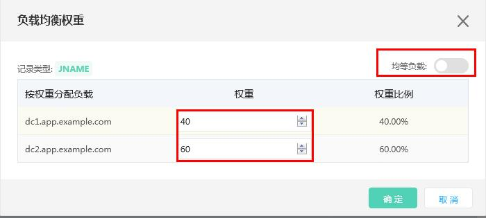
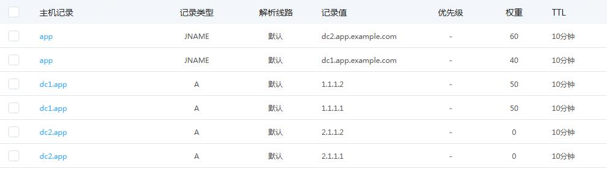

## **负载均衡设置**

### 概述
云解析负载均衡配置，指为解析记录配置不同的权重值，在应答DNS请求时，按照预设的权重返回不同的解析结果，将流量分配到不同的节点上，从而达到负载均衡的目的。

### 使用限制
权重设置仅支持"A/AAAA/CNAME/JNAME"记录，其中"A/AAAA"权重配置范围为0-100，"CNAME/JNAME"权重设置范围为1-100。权重仅在相同线路下生效。

### 操作指南
1. 登录云解析控制台。
2. 在域名解析界面，单击要操作的域名，进入解析设置页面。
3. 在域名解析页面，点击负载均衡，进入负载均衡管理页面。
4. 选择要操作的记录，选择修改设置多个解析记录的权重值，可以直接开启均等负载，按均等比例返回不同的解析记录值，实现多个解析记录流量均衡，关闭均等负载可以直接设置权重值，按照权重比例返回不同的解析记录值，实现按权重负载均衡。

### 使用场景
假设您有两个机房，机房承载流量能力不同，每个机房有多个流量入口，每个流量入口承载能力相同。以`example.com`为例，可以为用户创建一个流量入口域名`app.example.com`, 为每个机房创建一个流量入口域名 `dc1.app.example.com/dc2.app.example.com`。为用户使用域名创建JNAME负载均衡，实现流量按权重到不同机房，为每个机房域名设置A记录负载均衡，实现机房流量按权重到不同入口IP。解析记录设置如下：

按照权重设置，`app.example.com`的流量将有40%到达机房1，60%到达机房2，机房1、机房2的流量都按照50%-50%的比例到各自的入口IP。
