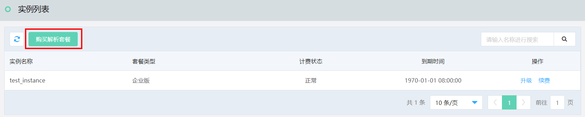
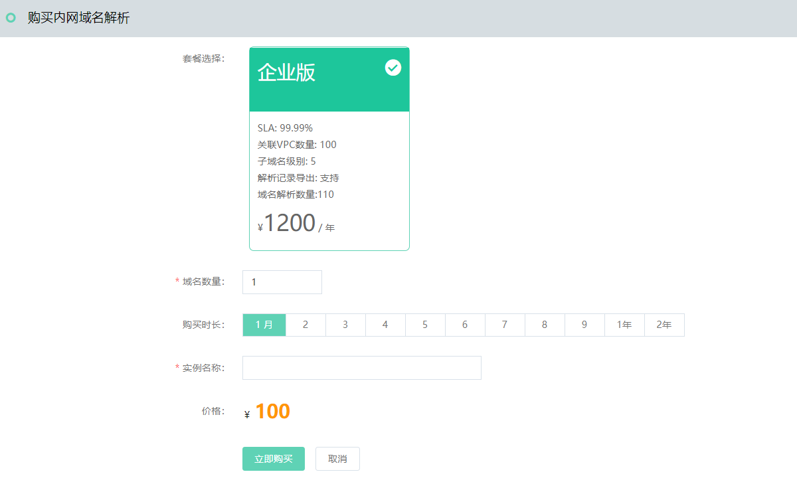

# 创建实例

本文介绍通过控制台创建 内网域名解析 实例。

## 操作步骤
1. 登录 [内网域名解析 控制台](https://privatezone-console.jdcloud.com/instance)。
2. 在“实例列表”页面，点击 **购买解析套餐** ，进入“购买内网域名解析”页面。

3. 默认套餐企业版，填写实例名称，选择域名数量和购买时长后，点击 **立即购买**。

购买支付以后，即成功创建一个实例。
