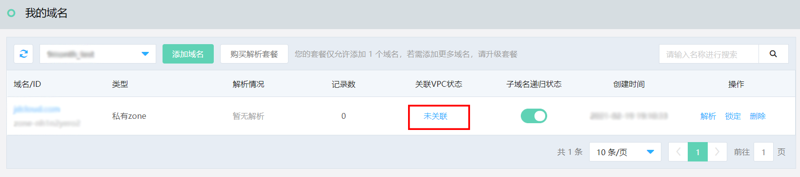
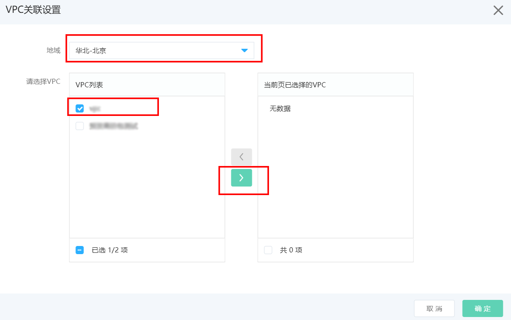
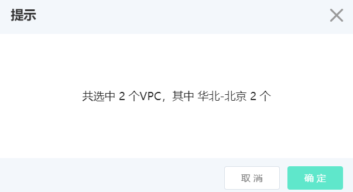
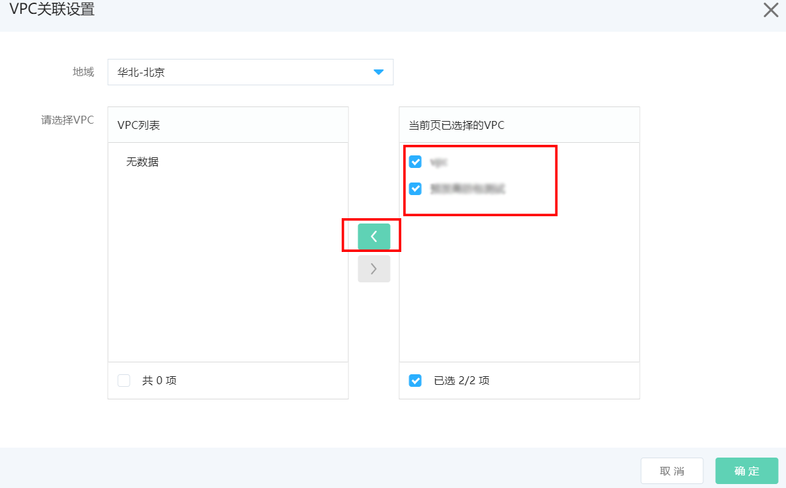

# 关联VPC

**需要注意的是**，一旦配置私有Zone并关联VPC，由于内网解析优先于公网解析，如果私有Zone域名和公网域名相同，则公网解析记录将被覆盖，并且在私有Zone子域名递归代理未开启的情况下，私有Zone中未配置解析记录的公网域名在该VPC内将无法访问。

例如在私有Zone中添加 **jdcloud.com**，未添加解析记录也未开启子域名递归代理情况下关联VPC 1，则VPC 1内所有云主机将无法访问jdcloud.com和其下的子域名，但VPC 1之外的其他主机访问jdcloud.com不受影响。

## 操作步骤

1、在域名列表中关联VCP状态一栏，点击 **未关联**，进入VPC关联设置界面。

2、选择需要关联VPC所在区域，勾选需要关联的VPC（支持多选），点击方向按钮，移入已选择页面，点击确定。

3、根据提示确认选择的区域和VPC数量，点击确定完成关联操作。

4、需要取消关联VPC时，点击 **已关联**，进入配置页面，勾选VPC并移出已选择页面即可。

