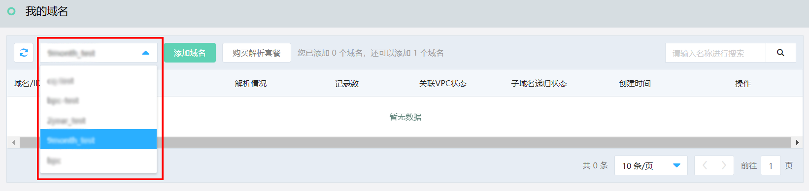
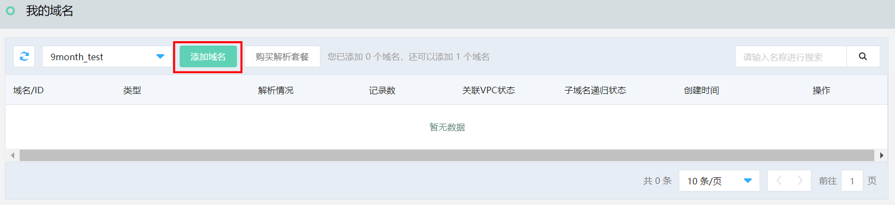
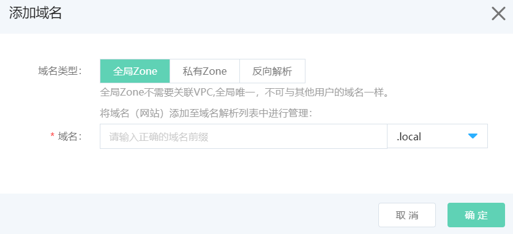
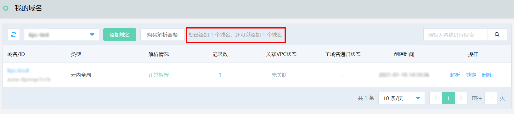
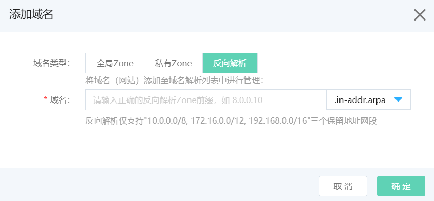

# 添加域名

## 添加私有Zone

  1、购买实例后，在实例列表中点击实例名称，或点击菜单栏域名解析进入 **我的域名** 页面，如购买多个实例，支持在下拉菜单中选择已购买的实例。

    
  
  2、点击 **添加域名**，选择私有Zone（可添加公网无法注册或已注册的域名，需要关联VPC），输入域名，默认勾选子域名递归解析代理，点击确定完成域名添加。
  
  
  
  
  
  3、域名添加后，支持在列表中查看域名相关信息，并可通过提示查看当前实例剩余域名数量，如达到套餐限制，可升级或购买新的实例。
  
  

## 添加反向解析

  点击 **添加域名**，选择反向解析（后缀固定为 .in-addr.arpa，需要关联VPC），输入域名前缀需按照IP地址逆向输入，且仅支持"10.0.0.0/8, 172.16.0.0/12, 192.168.0.0/16"三个保留地址网段，点击确定完成域名添加。
  
  

  添加域名规则：

  - 合法字符长度为1-63个字符（域名主体），不合法后缀则提示不合法。

  - 英文域名合法字符为a-z，0-9, “-“(不能在开头和结尾，以及同时在第三和第四字符位置)。

  - 中文域名是指在英文域名合法字符外，至少包含一个汉字（简体或繁体），中文域名字符长度以转换后的Punycode编码字符串为准。

  - 不支持“xn—开头”的输入，提示：不支持此格式。如为Punycode编码，请输入中文域名。
  
  - 域名级数不超过10级
