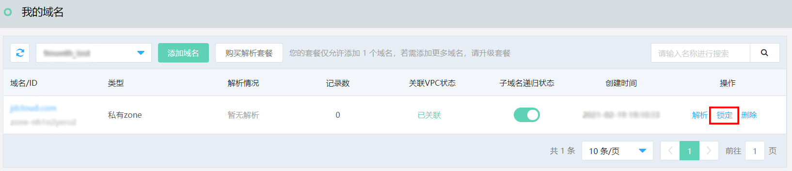
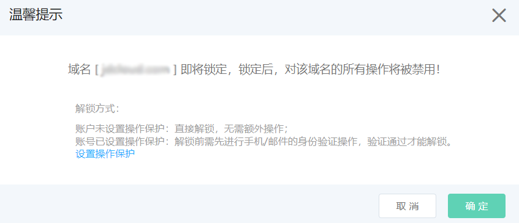
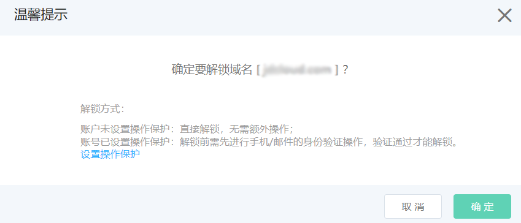

# 域名锁定

域名锁定功能，通过对重点保护的域名加锁的方式，来减轻非预期的误操作行为。

进入内网域名解析的 **我的域名** 页面，在操作栏中即可对关注的域名进行加锁和解锁操作。

## 锁定

1、找到需要加锁的域名，单击操作栏中的“锁定”按钮。

2、根据提示，选择是否开启操作保护。

如果设置了操作保护，则解锁时需要进行身份验证，身份验证通过以后才能解锁。

加锁后，域名解析页面的操作栏，将禁用任何修改的操作。

## 解锁

1、找到需要解锁的域名，单击操作栏中的“解锁”按钮。

2、根据提示，选择是否解锁。

- 未添加操作保护 

确定解锁后，即解除域名锁定。

- 已添加操作保护

完成身份验证后，即解除锁定。以手机认证为例，需要输入账号绑定的手机验证码以后，才能解锁。

