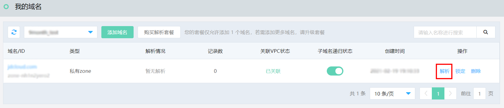
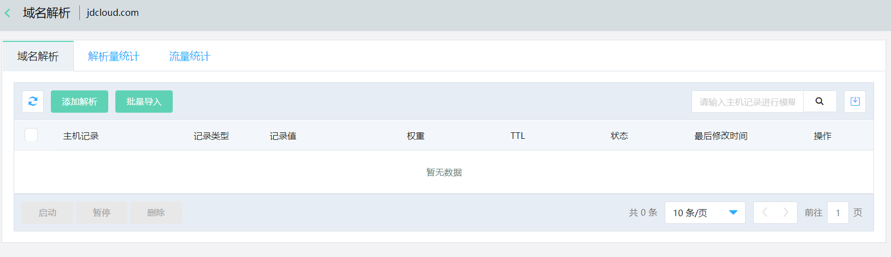
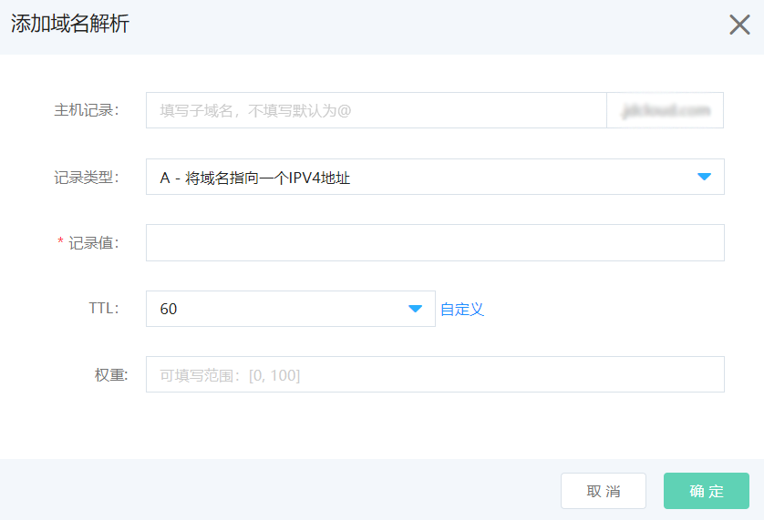

# 添加解析

1、在域名列表中查找需要添加解析记录的域名，点击 **解析** 按钮进入域名解析页面。

 

2、在域名解析页面，点击 **添加解析** 按钮。

  

3、在弹出的 **添加域名解析** 窗口中填写域名配置。

  
 
4、根据您的域名填写对应的记录。

其中带 * 号的为必填项，不同的记录类型添加的记录值不同
具体解析记录添加请参考[支持解析记录类型详解](../Parsing-Record-Operation/Detailed-Interpretation-Of-Parsed-Records.md)。
