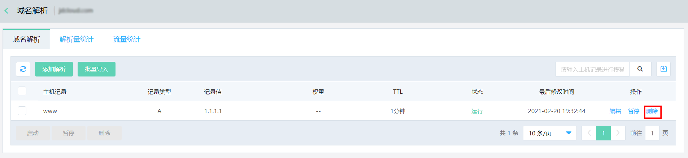

## 删除解析记录

  删除记录是高危操作，此条记录删除后，该条记录在内网域名解析中将不再有效，会直接影响到用户无法访问到该记录指向的地址。

  如果您要进行解析记录的删除操作，建议您务必要保留一个默认线路的解析记录，从而来避免您的访问者出现不可用情况。

  1、在解析记录列表中查询所要删除的记录，点击操作栏中的 **删除** 按钮。

  

  2、点击确认后会将该条解析记录删除。
  
  
