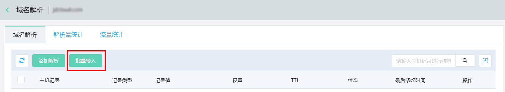
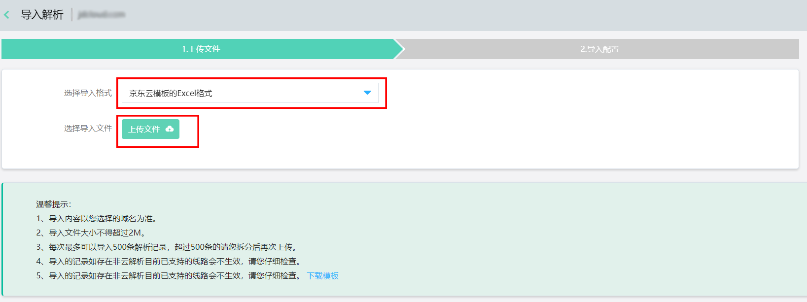
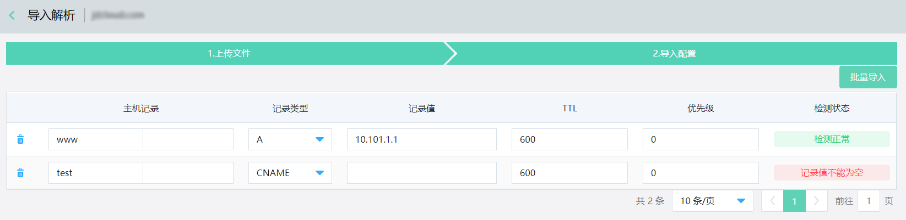
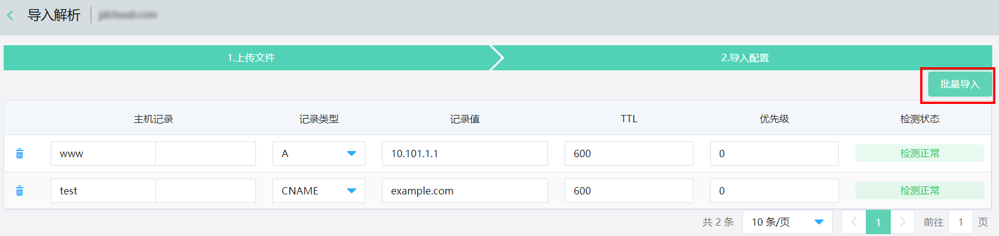
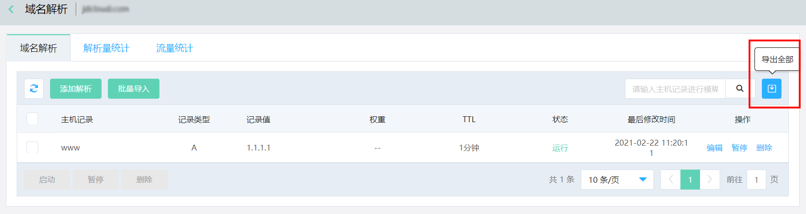

# 解析记录批量导入/导出

  1、点击域名解析页面中的 **批量导入** 按钮后进入导入解析页面

  
  
  2、选择您需要导入的文件格式后点击 **上传文件** 按钮
  
  

  若导入记录的格式出现错误会在页面中显示，请您按照页面提示修改需要导入的记录。

  

  若导入记录全部正确无误，页面显示检测正常，此时点击 **批量导入** 按钮即可完成导入。

  

  导入记录数量较多时，需要耐心等待。
  
  3、添加完成的解析记录，建议定期进行全量导出保存至本地，便于误删除后进行恢复操作。在域名解析界面点击左上角的 **导出全部** 按钮，默认以.csv的格式导出文件，导出后的文件可以直接用于批量导入。
  
  
