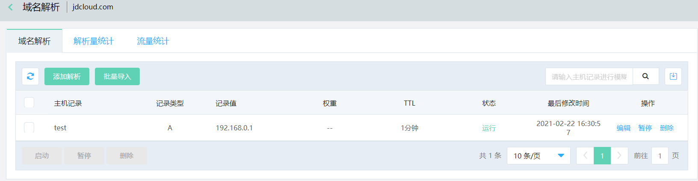
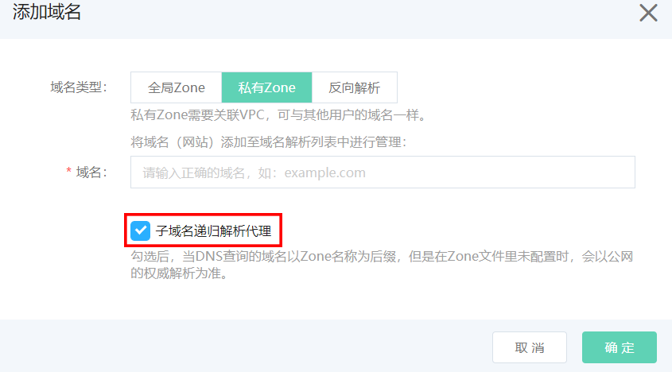
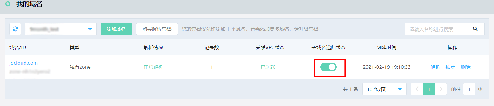

# 子域名递归解析代理

私有Zone支持子域名递归解析代理，开启此功能后，在关联的VPC内访问Zone文件中未配置解析的子域名时，私有Zone会进行公网递归解析代理，将递归查询结果返回VPC内。

例如在jdcloud.com的域名解析中配置了一条test.jdcloud.com子域名的A记录，则在关联VPC内访问test.jdcloud.com时会返回内网地址192.168.0.1，而访问www.jdcloud.com时则进行公网递归查询并返回相应结果。

## 开启子域名递归解析代理

创建私有Zone时默认勾选开启子域名递归解析代理。

## 关闭子域名递归解析代理

在我的域名界面，域名列表中的子域名递归状态栏点击开关，根据提示确认关闭即可。

