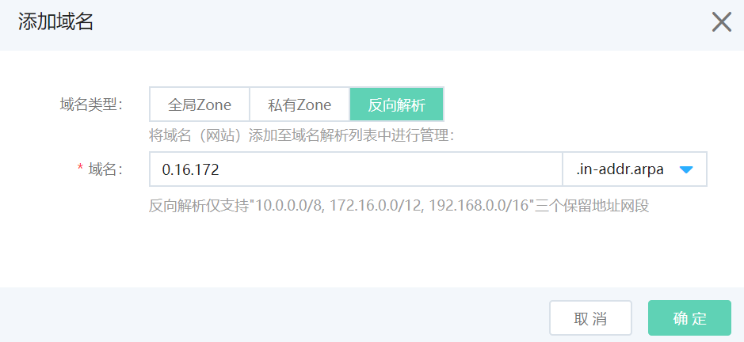
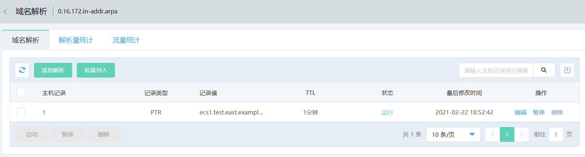
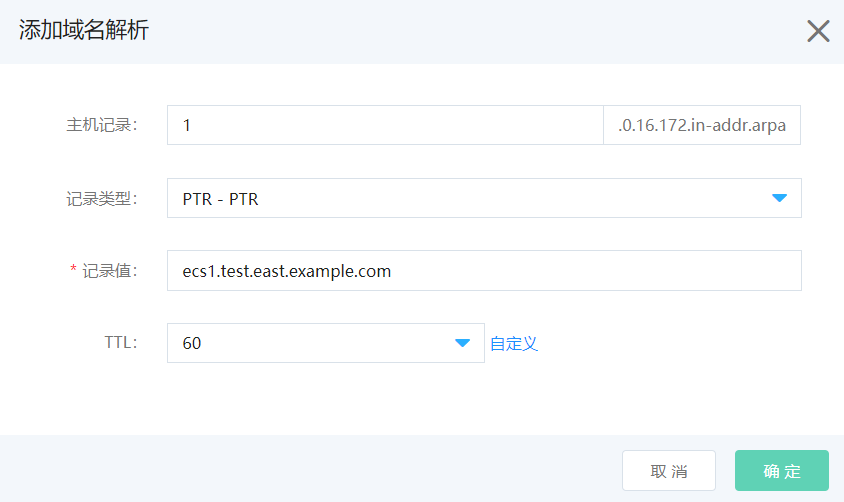

# 反向解析

反向解析即IP地址到域名的映射，通过PTR记录查询IP指向的域名。

反向解析的域名后缀为 .in-addr.arpa，添加主机记录时需要按逆向顺序填写IP地址，例如1.0.16.172.in-addr.arpa代表IP地址172.16.0.1的主机反向解析记录。反向解析需要关联VPC，且仅支持"10.0.0.0/8, 172.16.0.0/12, 192.168.0.0/16"三个保留地址网段。

## 操作步骤

1、在我的域名页面，添加域名，选中反向解析，按逆向顺序填写IP地址，例如0.16.172。

2、点击 **解析** 按钮进入域名解析页面。

3、点击 **添加解析** 按钮进行解析记录添加。

4、填写主机记录和记录值，例如主机记录为1的PTR记录值为ecs1.test.east.example.com，代表172.16.0.1的IP地址反向解析为ecs1.test.east.example.com的域名。

