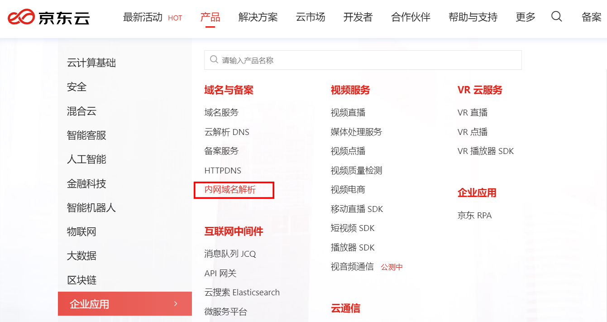
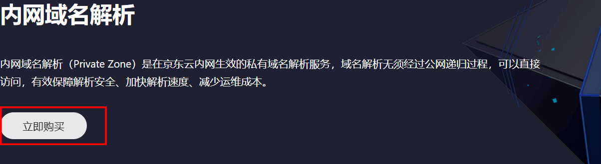

# 购买流程

本文介绍 内网域名解析 实例的购买入口。

## 入口1：[产品介绍页](https://www.jdcloud.com/products/private-zone)

1. 登录[京东云官网](https://www.jdcloud.com)。

2. 选择“产品>企业应用>域名与备案>内网域名解析”，具体见下图。

3.在内网域名解析的产品介绍页，点击 **立即购买**。

4.购买的具体操作，请参考[创建实例](../Operation-Guide/Create-Instance.md)。

## 入口2：[内网域名解析 控制台](https://privatezone-console.jdcloud.com/instance)

1. 登录[京东云官网](https://www.jdcloud.com)。

2. 选择“控制台”，具体见下图。

3.登录控制台，具体操作请参考[创建实例](../Operation-Guide/Create-Instance.md)。
