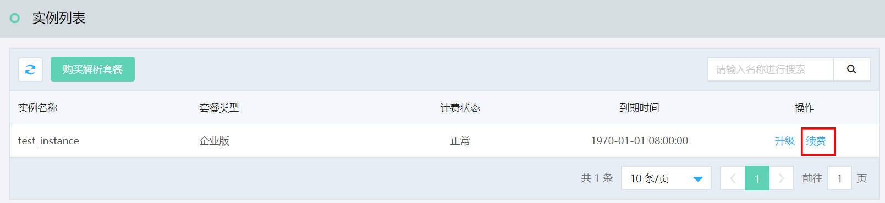
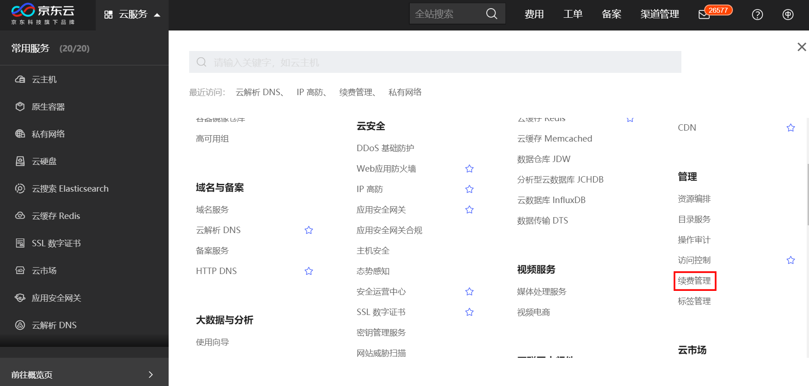
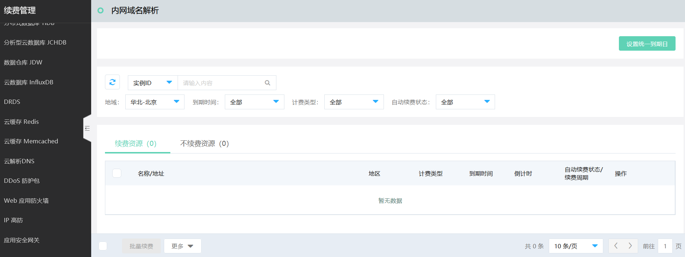

# 续费流程

本文介绍 内网域名解析 实例的续费入口。

## 入口1：[内网域名解析 控制台](https://privatezone-console.jdcloud.com/instance)

1. 进入京东云控制台，通过页头导航，依次点击 **云服务** >  **域名与备案** >  **内网域名解析**,打开“实例列表”页面。

2. 在操作项中点击 **续费**，进入“续费页面”，进行续费操作。

   

## 入口2：[续费管理控制台](https://renewal-console.jdcloud.com/renew/privatezone)

1. 进入京东云控制台，通过页头导航，依次点击 **云服务** > **管理** > **续费管理** ,打开“续费管理”页面。

   
2. 在“续费管理”页面，点击 **内网域名解析**，查看 内网域名解析 实例。

3. 在操作项中点击 **续费**，进入“续费页面”，进行续费操作。

