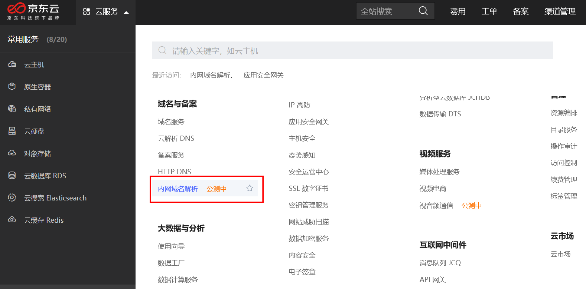
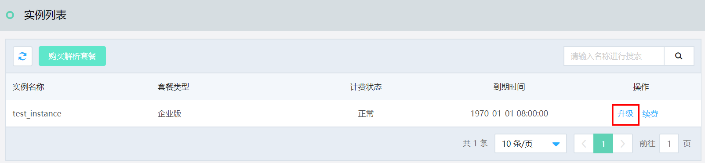
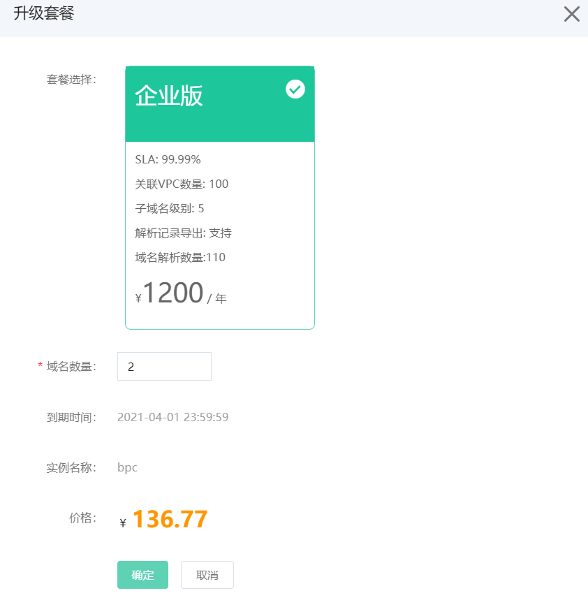

# 升级流程

本文介绍 内网域名解析 实例的升级入口。

## 入口：[内网域名解析 控制台](https://privatezone-console.jdcloud.com/instance)

1. 进入京东云控制台，通过页头导航，依次点击 **云服务** >  **域名与备案** >  **内网域名解析**，打开“实例列表”页面。

2. 在操作项中点击 **升级**，进入“升级页面”，进行升级操作。

3. 在升级页面中，支持对域名数量进行调整。

