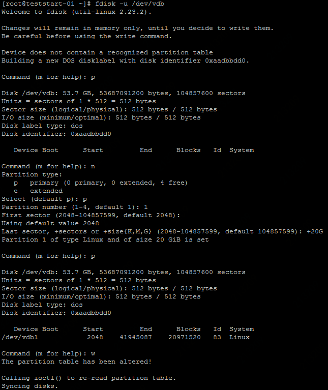
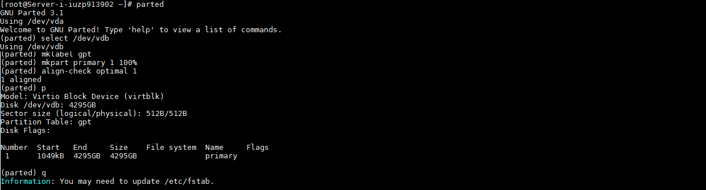
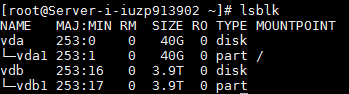

# Linux数据盘分区

新创建的云硬盘不包含分区及文件系统。您可以选择直接在裸盘上创建文件系统或对云盘进行分区后创建文件系统。本文将介绍如何在Linux系统下（以CentOS系统为例），在数据盘创建分区。

## 准备工作

- 单独购买的云硬盘必须挂载至云主机后，才能在云主机内进行分区。您可以在控制台“弹性计算”-“云硬盘”-“硬盘实例”页面中看到各云硬盘的“状态”，以便确认是否为“已挂载”。挂载云硬盘操作详见[挂载云硬盘](https://docs.jdcloud.com/cn/cloud-disk-service/attach-cloud-disk)。
- 云硬盘支持的分区格式包括： MBR（Master Boot Record，主分区引导记录）和GPT（Globally Unique Identifier Partition Table，GUID分区表）。MBR可处理的最大容量为2 TB，且只支持划分4个主区。GPT可支持大于2 TB容量的云硬盘。由于MBR和GPT 分区格式的转换无法在原盘上保留数据（需要将数据拷贝到另一块云盘上进行），因此建议您在预期单云盘数据量大于2TB时，使用GPT分区。
- 直接在云硬盘创建分区后，如果需要扩容云硬盘，必须暂停对云盘的io进行分区扩容和文件系统扩容。如果您在云盘上的业务不能暂停，建议您使用多块云盘搭建LVM或RAID，实现动态扩容。

## 创建MBR分区

以下将介绍使用fdisk创建云盘分区，支持**不超过2TB的云硬盘。**

1. 通过远程连接或者ssh登录云硬盘挂载的云主机。

2. 运行 lsblk 命令确认数据盘是否已经挂载。

3. 使用fdisk创建分区，执行：

   1）执行`fdisk -u /dev/vdb`   对/dev/vdb盘进行分区。

   2）输入 `p` ，显示该数据盘的分区情况，确认该云盘是否已存在分区。

   3）输入 `n` ，创建一个新的分区。

   4）输入 `p` ，指定新创建的分区为”主分区“。如需创建扩展分区，本步骤请输入 `e` （extended）。

   5）输入分区编号并按回车，创建一个分区请直接输入`1`。

   6）输入该分区起始扇区编号，括号中列出的是可供选择的范围。回车即采用默认的2048。

   7）输入该分区结束的扇区编号，回车默认采用最大值，也可以使用 `+20G`这样的形式，指定分区的大小。（注，分区大小不可超过磁盘剩余可分配空间的大小）

   8） 输入 p ， 验证上一步划分是否成功；

   9） 输入 w ，开始分区。fdisk将在分区完成后退出。

   


## 创建GPT分区

当您所使用的云硬盘大小超过2TB或预计会超过2TB，您需要创建GPTfen

fdisk工具不支持创建GPT分区，因此需要使用parted工具实现。

您可以通过执行

```
yum install -y parted
```

来在安装parted工具。以下操作步骤默认已安装了parted工具。

1. 通过远程连接或者ssh登录云硬盘挂载的云主机。

2. 运行 lsblk 命令确认数据盘是否已经挂载。

3. 执行 `parted` ，打开parted工具。

   1） 执行 `select /dev/vdb`  ，选择需要分区的云盘设备；

   2） 执行 `mklabel gpt` ，将分区格式设置为GPT；

   3） 执行 `mkpart primary 1 100%` ，将整个磁盘从第1 MB到全盘划分为1个主分区。

   注： mkpart命令的完整形式为： **mkpart** *[part-type name fs-type] start end* ，其中当start的取值达到分区对齐时，磁盘获得最佳性能。
   
   4） 执行  `align-check optimal 1`  检查分区是否对齐，如果返回 1 **not** aligned，则分区未对齐。
   
   注： 可以通过计算最佳分区模式的起始扇区值来确定保证分区对齐，计算公式为： （[optimal_io_size]+[alignment_offset]） / [physical_block_size]  。公式中对应的参数值为：
   
   ```
   cat /sys/block/vdb/queue/optimal_io_size
   
   cat /sys/block/vdb/alignment_offset
   
   cat /sys/block/vdb/queue/physical_block_size
   
   cat /sys/block/vdb/queue/minimum_io_size
   ```
   
   在直接操作裸盘时，start 取“1”、“2048s”或“1040kb”均可以达到分区对齐。
   
   5） 执行 `p` 查看新建分区的详细信息。
   
   6） 执行 q ，退出parted分区工具。



	7）此时执行 `lsblk` 可以看到 /dev/vdb下已经增加了“/dev/vdb1”的新分区。


