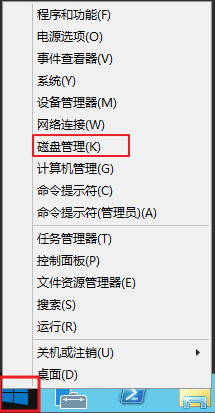
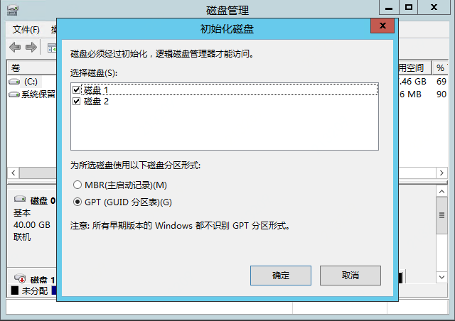
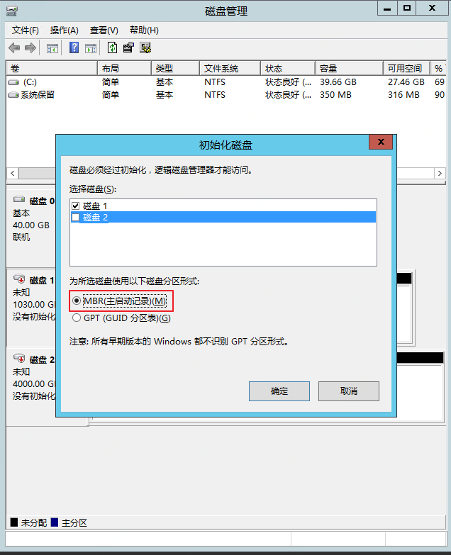
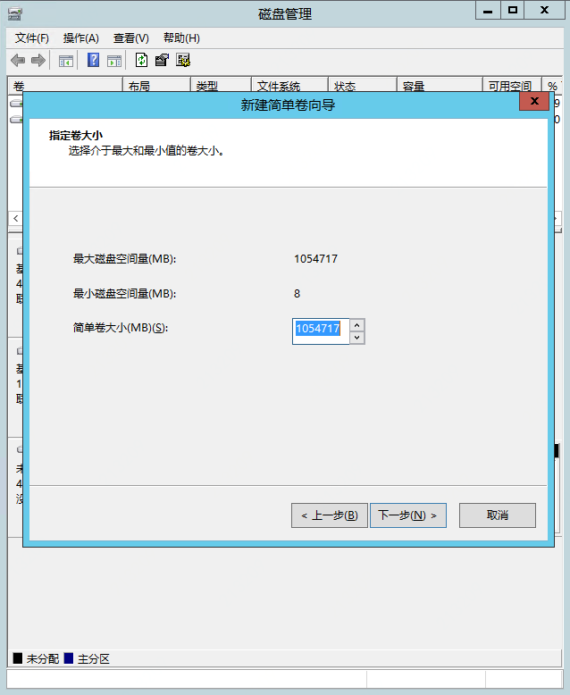
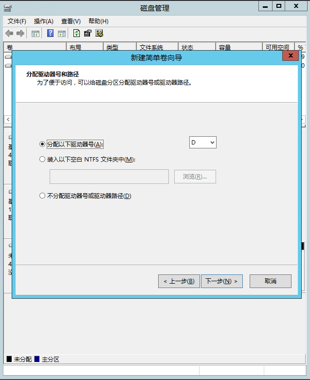
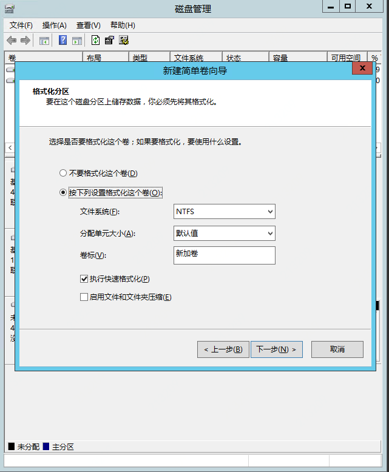
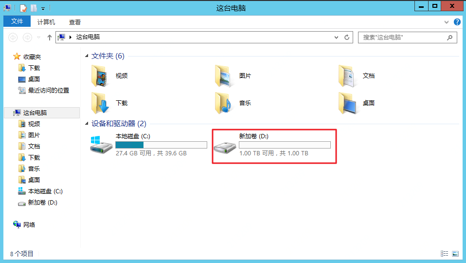

# Windows数据盘分区

新创建的云硬盘不包含分区及文件系统。您可以选择直接在裸盘上创建文件系统或对云盘进行分区后创建文件系统。本文将介绍如何在Windows系统下（以Windows Service 2012 R2 标准版 64位 中文版系统为例），在数据盘创建分区。

## 准备工作

- 单独购买的云硬盘必须挂载至云主机后，才能在云主机内进行分区。您可以在控制台“弹性计算”-“云硬盘”-“硬盘实例”页面中看到各云硬盘的“状态”，以便确认是否为“已挂载”。挂载云硬盘操作详见[挂载云硬盘](https://docs.jdcloud.com/cn/cloud-disk-service/attach-cloud-disk)。
- 云硬盘支持的分区格式包括： MBR（Master Boot Record，主分区引导记录）和GPT（Globally Unique Identifier Partition Table，GUID分区表）。MBR可处理的最大容量为2 TB，且只支持划分4个主区。GPT可支持大于2 TB容量的云硬盘。由于MBR和GPT 分区格式的转换无法在原盘上保留数据（需要将数据拷贝到另一块云盘上进行），因此建议您在预期单云盘数据量大于2TB时，使用GPT分区。
- 直接在云硬盘创建分区后，如果需要扩容云硬盘，必须暂停对云盘的io进行分区扩容和文件系统扩容。如果您在云盘上的业务不能暂停，建议您将云硬盘转为windows”动态磁盘“，实现动态扩容。”动态磁盘“不能用于系统盘。

## 创建磁盘分区

以下将介绍使用windows自带的”磁盘管理“工具对云硬盘进行分区。

1. 远程连接Windows云主机；

2. 在Windows Server桌面，右键点击”开始“菜单，选择”磁盘管理“。

   

3. 进入”磁盘管理“后，系统会自动识别未初始化的磁盘。

   

   也可以通过右键单击所需初始化的磁盘，选择”初始化磁盘“。

   

4. 在弹出框中，选择所需初始化的磁盘及分区格式。此示例中选用MBR分区格式。

   注：可选的磁盘分区形式包括MBR和GPT两种。小于2TB的云硬盘，可以选用MBR分区，大于2TB的云硬盘或预计未来将扩容超过2TB的云硬盘，建议选用GPT分区。

   

5. 点击”确定“后，该磁盘由”没有初始化“状态变更为”联机“状态。此时，右键单击该磁盘的“未分配”区域，选择“新建简单卷”，进入创建向导。根据向导提示，依次指定卷大小、驱动区号和文件系统格式，单击“完成”后，即可完成对该磁盘的分区操作。

   

   

   

   6. 完成后，在“这台电脑“中，即可看到新增的分区及格式化后的云硬盘。

      
