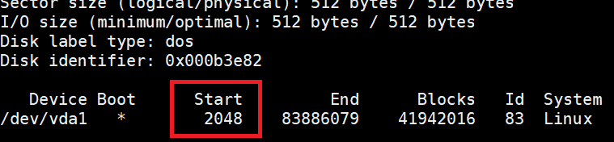
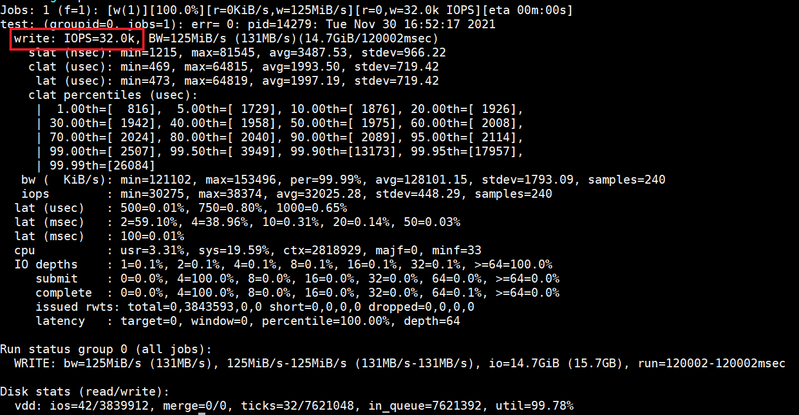
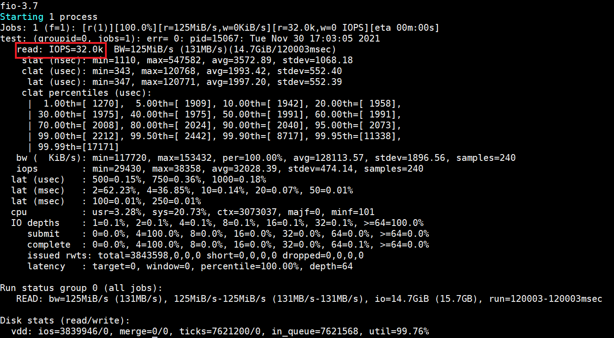
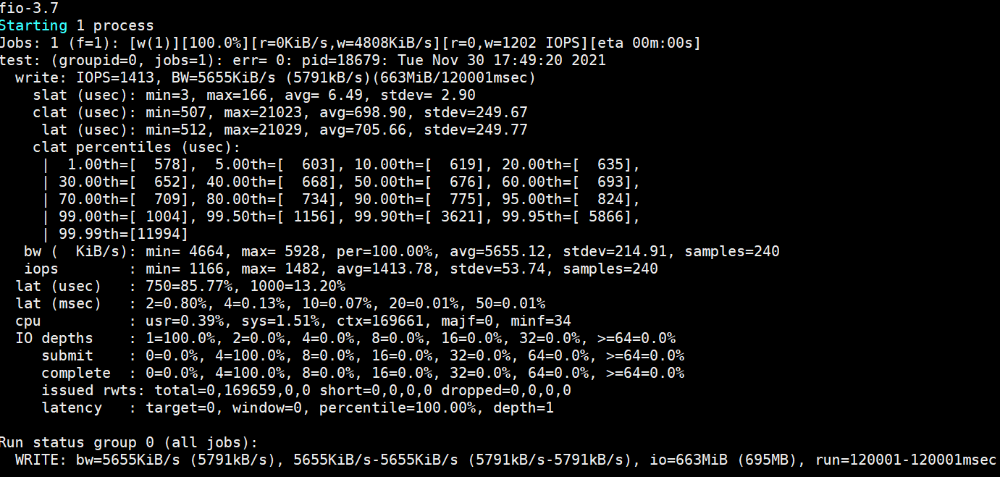
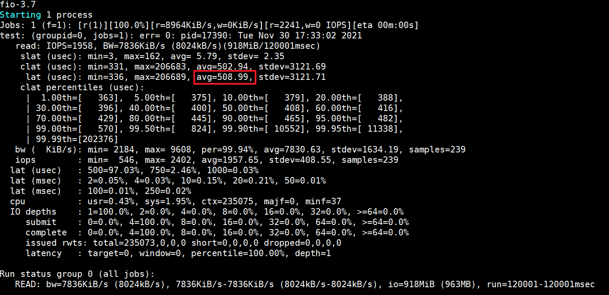
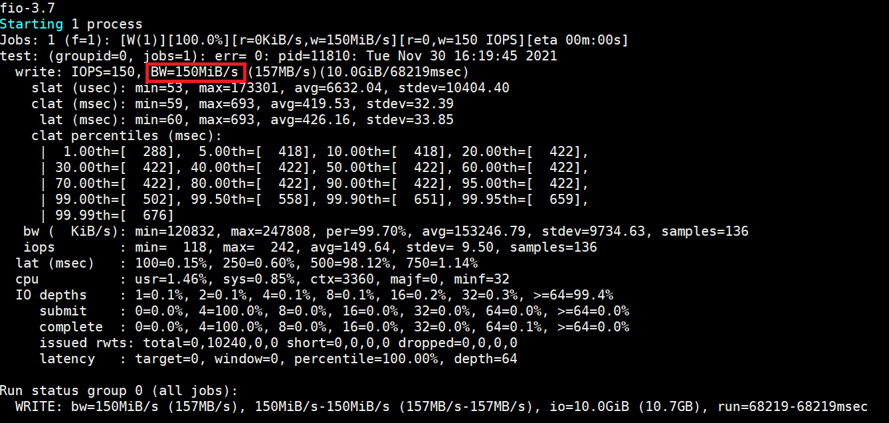
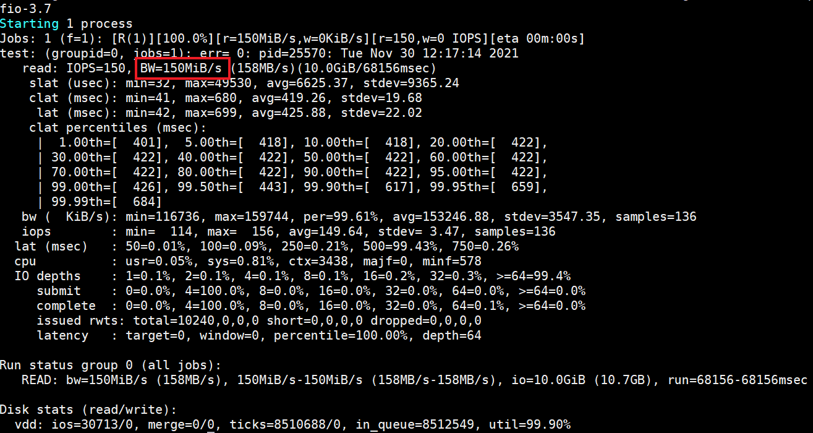

# 性能测试


## 块存储性能指标

块存储的性能指标主要包括吞吐量、IOPS和IO时延。

吞吐量（Bandwidth）指每秒成功处理的I/O数据量，单位通常为MB/s。在对短时间内读写的数据量敏感的业务，依赖云硬盘的吞吐量性能。

IOPS（Input/Output Operations per Second）指每秒能处理的I/O个数，单位为次。一般在IO密集型的业务，比如数据库类的应用中，依赖云硬盘的IOPS性能。

访问时延（Latency）指处理一个I/O需要的时间，单位通常为ms。一般对存储串行读写的业务，比如需要严格按照先后顺序落盘的日志，依赖云硬盘的时延性能。

云硬盘的规格、容量、I/O大小、并发数均会对块存储的性能指标造成影响。查询不同规格的云硬盘性能指标上限，请见[实例规格](https://docs.jdcloud.com/cn/cloud-disk-service/instance-type)


## 测试准备

### 测试环境

1. 建议新建云主机，并在非系统盘上进行性能测试。避免在有业务数据的数据盘上进行测试。以免性能测试损坏系统盘或业务数据。
2. 建议在空闲云硬盘实例上进行测试，避免其他应用对性能测试结果造成影响。
3. 测试云硬盘性能时，建议直接测试落盘，如/dev/vdb；测试文件系统性能时，可指定具体文件进行测试，如/mnt/testfile

### 测试工具

本片文档中使用Fio工具，配合libaio I/O引擎进行测试。如选用其他工具，建议确认测试工具可以调整测试所用的IO块大小、并发数和禁用缓存，或者准确了解测试时的以上数值，以得到准确的性能测试结果。

挂载云主机：1核4GB 通用 标准型

系统盘：通用型SSD云盘 (40GB)

系统镜像：CentOS 7.3 64位

测试对象：性能型SSD云盘（1200GB）


> 注意：
>
> 在使用fio工具进行裸盘测试时，请不要在已创建文件系统的磁盘上进行，会破坏文件系统结构。如果需要，请提前创建快照做好备份。

## 执行测试

1. 测试前，请先依次执行下列语句以安装libaio和fio

```
yum install libaio -y
yum install libaio-devel -y
yum install fio -y
```

2. 执行下列语句以确认块存储设备是否已4KB对齐

```
fdisk -lu
```

3. 返回结果如图所示，若Start值能被8整除，则表示4KB对齐，否则请完成对齐后再继续进行测试。
4. 
5. IOPS性能测试：随机写 

```
fio -ioengine=libaio -numjobs=1 -bs=4k -direct=1 -rw=randwrite -size=20G -filename=/dev/vdb -name=test -iodepth=64 -runtime=120 --group_reporting 
```

IOPS随机写测试的返回结果如图中所示

IOPS性能测试：随机读

```
fio -ioengine=libaio -numjobs=1 -bs=4k -direct=1 -rw=randread -size=20G -filename=/dev/vdb -name=test -iodepth=64 -runtime=120 --group_reporting 
```

IOPS随机读测试的返回结果如图所示

时延性能测试：随机写

```
fio -ioengine=libaio -numjobs=1 -bs=4k -direct=1 -rw=randwrite -time_based=1 -filename=/dev/vdb -name=test -iodepth=1 -runtime=120 --group_reporting 
```

时延随机写测试返回结果如图所示

时延性能测试：随机读

```
fio -ioengine=libaio -numjobs=1 -bs=4k -direct=1 -rw=randread -time_based=1 -filename=/dev/vdb -name=test -iodepth=1 -runtime=120 --group_reporting 
```

时延随机读返回结果如图所示

吞吐性能测试：顺序写

```
fio -ioengine=libaio -numjobs=1 -bs=1M -direct=1 -rw=write -size=10G -filename=/dev/vdb -name=test -iodepth=64 -runtime=120 --group_reporting 
```

吞吐写测试返回结果如图所示

吞吐性能测试：顺序读

```
fio -ioengine=libaio -numjobs=1 -bs=1M -direct=1 -rw=read -size=10G -filename=/dev/vdb -name=test -iodepth=64 -runtime=120 --group_reporting 
```

吞吐读测试返回结果如图所示

自定义测试场景： 可根据应用需要修改相关参数取值，具体可参考下方列表

> 1. 修改参数取值将会影响到最终测试结果，具体规则可参考[实例规格](https://docs.jdcloud.com/cn/cloud-disk-service/instance-type)
>
> 2. 在实际压测中，有可能会出现fio统计吞吐量与管控台统计数据不一致，我们认为是由于在指定filename的前提下，多线程会造成堵塞波动，影响测试结果，建议numjobs取值为1。

| 参数             | 说明                                                         |
| :--------------- | :----------------------------------------------------------- |
| -direct          | 指定direct模式，取值为（1），表示忽略缓存，数据直写。        |
| -iodepth         | 测试时请求的I/O队列深度。                                    |
| -rw              | 表示测试时的读写策略：<br />**read**：顺序读<br />**write**：顺序写<br />**randread**：随机读<br /<br />**randwrite**：随机写<br /<br />**randrw**：混合随机读写 |
| -ioengine        | IO引擎，定义下发IO请求方式，支持libaio、sync、psync、vsync等，推荐使用libaio异步方式。 |
| -bs              | Block size for I/O units，表示单次I/O块的大小。              |
| -size            | IO测试文件大小。                                             |
| -numjobs         | 表示测试并发进程/线程数。                                    |
| -runtime         | 表示测试执行时间                                             |
| -group_reporting | 测试结果展示方式，group_reporting表示汇总每个进程的统计信息，而非以不同job汇总展示信息。 |
| -filename        | 指定的云盘设备名称，即待测试的云盘名称。                     |
| -name            | 测试任务的名称。                                             |


