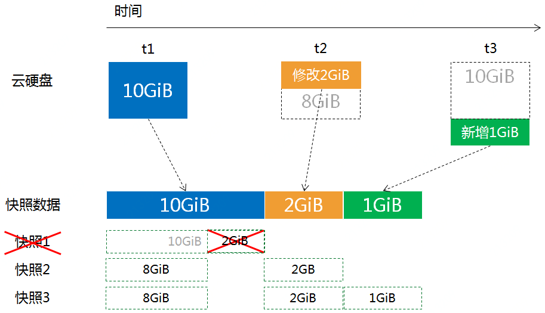

# **云硬盘快照容量说明**

云硬盘快照用于对云硬盘上的数据进行备份，以便恢复云硬盘上的数据或者批量复制云硬盘。云硬盘快照上的数据记录了开始制作云硬盘的时刻云硬盘上的所有数据。

## 增量快照

制作云硬盘快照时，首次快照将备份全量数据，后续每次备份均为增量备份。

下图以一块云硬盘为示例，在t1时刻，该云硬盘上包含10GiB的数据。此时，对该云硬盘做第一个快照，会复制盘上所有的10 GiB数据，形成快照1。

在t2时刻，该云硬盘上的10 GiB数据中，修改了2 GiB数据。此时，对该云盘做快照，会复制修改的2 GiB数据，并引用第一个快照中未修改的8 GiB数据，形成快照2。

在t3时刻，该云硬盘上在已有10 GiB数据的基础上，新增了1 GiB数据。此时，对该云硬盘做快照，会复制新增的1GiB数据，并引用之前快照中的8GiB +2 GiB数据，形成快照3。

因此，在t3时刻，云硬盘数据量为 11 GiB，当前快照数据量为13 GiB。

## 删除快照

快照数据是以数据库块的形式存储的，最小单位为4MB。删除快照时，会删除该快照对数据的引用关系，同时删除不再被任何快照引用的数据块。

仍以上述场景为例，假设删除快照1。首先删除了快照1对第一次备份的10 GiB数据的引用关系，然后清理不被引用的数据。因为快照1对应的10 GiB数据中，8 GiB仍被快照2和快照3应用，2 GiB数据不被后续的任何快照引用，因此，清理2 GiB数据。

所以删除快照1后，快照数据量由13 GiB变为了11 GiB。

