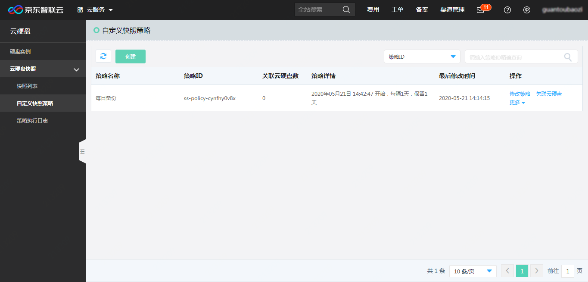

# 自定义快照策略

## 创建自定义快照策略

登录京东智联云控制台后，在“弹性计算”-“云硬盘”-“云硬盘快照”下，找到“自定义快照策略”菜单，点击进入自定义快照列表页面。

在自定义快照列表页面，可以看到当前登录账号下已有的策略。策略按照“最后修改时间”由近至远排列。

点击列表左上方的“创建”按钮，可以创建新的快照策略。

其中：

“策略生效时间”指此策略第一次开始执行的时间，须晚于当前时间+30分钟。选择后，可在下方的“下次备份时间”中确认备份时间是否符合预期。请注意，快照策略的生效时间并不等于策略中所有云硬盘开始备份的时间。在快照策略开始执行时，会根据需要备份的数据量大小和当时的服务负载情况，形成备份队列，对云硬盘依次开始备份。实际备份时间以备份形成的快照“创建时间”为准。

“备份间隔”可以选择以“天”、“周”、“月”和“小时”为单位。为避免同一策略前后两次任务间隔过短，引起冲突，最短间隔时间为12小时；

“快照保留时间”可以选择保留固定天数，也可以选择“永久保留”。如果选择保留固定天数，则快照会在到期时被自动删除。快照的删除时间可在“云硬盘”-“云硬盘快照”-“快照列表”中查看到；

“备份完成后发送通知”勾选后，将会在策略执行完成后，短信或（及）邮件方式对指定的联系人或联系组发送策略执行结果通知。联系人或联系组可在“账户管理”-“[联系人管理](https://uc.jdcloud.com/account/contacts)”中进行设置。

## 修改策略

用户可对已创建的快照策略进行修改。在“快照策略列表”中，对需要修改的策略点击“操作”列中的“修改策略”。在新开窗口中，可对策略的名称、策略生效时间、备份间隔、快照保留时间和通知的联系人、联系组进行修改。

其中，“策略生效时间”不能早于该策略上一次执行时间后的12小时，也不能早于当前时间+30分钟。

对快照策略的修改将在快照策略**下次执行**时生效。

## 关联云硬盘

创建自定义快照策略后，即可为该策略关联云硬盘，实现对云硬盘的定期备份。

云硬盘与快照策略是一对一关系，即一块云硬盘同一时间内只能与一个快照策略进行关联。已关联策略的云硬盘在关联另外的自定义快照策略时，会覆盖之前的关联关系。

在快照策略列表页，点击快照策略右侧“操作”列中的“关联云硬盘”按钮，即可为该条策略关联云硬盘。在弹窗中的“未关联”页签中，勾选需要关联的云硬盘，点击右下方的“关联”按钮，即将所选云硬盘以该策略进行备份。

一次可对多块云硬盘进行关联操作。可以通过列表上方的“当前地域”切换不同地域的云硬盘。也可以通过“云硬盘ID”、“云硬盘名称”或者“实例ID”搜索对应的云硬盘。

切换至“已关联”页签，可以查看该策略已经关联的云硬盘。勾选其中的云硬盘，点击“解除关联”，将停止该策略下对选中云硬盘的自动备份。

## 删除策略

在自定义快照策略列表页面，点击快照策略的“操作”列“更多”中的“删除快照策略”按钮，确认后，可删除快照策略。

请注意，策略删除后将不再自动备份已绑定的云硬盘。

## 策略执行日志

点击“云硬盘快照”菜单中的“策略执行日志”，可以查看所有快照策略每次执行的结果。其中：

“备份开始时间”，指策略本次开始备份关联的第一块云硬盘的时间；请注意，并不是所有关联的云硬盘都在这个时间点开始备份；

“快照制作数量”，指本次执行快照制作任务的数量，与该策略在这一时间点关联的云硬盘数量相等；

“成功数量”，指成功完成快照制作的数量，如果这个数量和“快照制作数量”相等，则本次策略执行时，所有云盘都成功备份；

“失败云硬盘ID”，指本次执行时，未能成功制作快照的云硬盘ID。仅当云硬盘处于“可用”或“已挂载”状态时，才可正常进行快照制作。因此当快照策略开始执行时，如果该云硬盘在“挂载中”、“卸载中”或“制作快照中”等状态，则无法按计划进行备份。

在“自定义快照策略”列表页中，点击策略右侧“操作”列中的“策略执行日志”，也可以跳转到“策略执行日志”页面，查询该条策略的执行日志。
