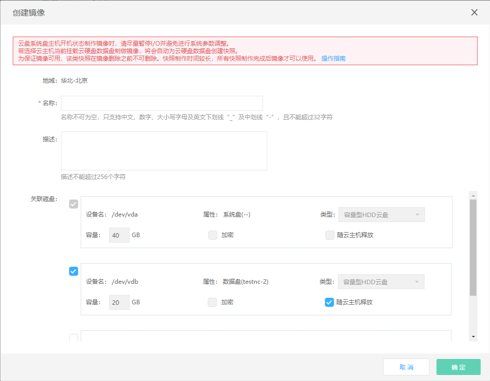

# 基于实例创建私有镜像
实例创建后，可定期或在实例系统环境或软件更新后通过制作私有镜像来为实例数据进行备份，私有镜像可用于批量部署或系统异常时的备份恢复。

## 前提条件及限制
* 云盘系统盘实例，支持开机(运行中)/关机（已停止）状态下制作私有镜像；本地系统盘实例，仅支持关机（已停止）状态下制作私有镜像；
* 若实例系统盘为云硬盘或实例挂载了数据盘，则除私有镜像配额外，还需要占用云硬盘快照配额，因此请在操作前确保镜像和云硬盘快照配额充足；
* 若当前实例系统盘为本地盘，则创建完成后的私有镜像为本地盘系统盘镜像；若当前实例系统盘为云硬盘，则创建完成后的私有镜像为云硬盘系统盘镜像。您可通过[镜像类型转换](Convert-Image.md)将本地盘系统盘镜像转换为云硬盘系统盘镜像后使用;
* 本地盘系统盘的数据可靠性远低于云盘系统盘，在发生迁移或宿主机宕机等情况下有丢失数据的风险。因此，本地系统盘镜像在有基于其创建的主机时，将无法删除，如因此限制导致镜像配额不足，请提交工单申请上调配额;
* 若主机挂载了本地盘数据盘（比如GPU实例规格主机），则由于本地数据盘不支持制作快照，因此该情况下制作的私有镜像将无法包含本地数据盘。

>请注意： 
>对于Linux系统，若该实例在/etc/fstab内配置了数据盘的自动挂载命令，或在/etc/udev/rules.d中配置了70-persistent-net.rules，制作私有镜像前还请删除，否则基于私有镜像创建的实例可能无法正常启动。
		
## 操作步骤
1. 访问[云主机控制台][1]，即进入实例列表页面。或访问[京东云控制台][2]点击顶部导航栏 **弹性计算-云主机-实例** 进入实例列表页。
2. 选择要创建私有镜像的实例，点击 **更多-制作镜像**。

3. 在创建镜像的弹窗中，完成对私有镜像“名称”、“描述”的补充，点击【确定】，开始私有镜像创建。
4. 制作镜像除了备份系统盘以外，您可以选择一同备份实例当前挂载的云硬盘数据盘（本地数据盘不支持快照功能），数据盘将以快照的形式与系统盘镜像进行关联，并显示在私有镜像详情页中的“设备映射信息”中，作为后续使用该私有镜像创建实例时数据盘的预设配置，方便快速整机部署。如果您希望对数据盘的容量进行修改可在基于该镜像创建主机时调整。点此详见数据盘[设备名分配规则](../Storage/Assign-Device-Name.md)。
5. 制作整机镜像耗时较长，为避免制作失败，请在制作过程中停止对主机和云硬盘的其他操作，同时请确保您当前实例和云硬盘快照的配额充足。

6. 提交的私有镜像，经过“创建中”，“复制中”两个中间状态，最终创建完成，变为“可用”状态，可以正常使用。中间状态，不可对镜像进行【共享】，【创建云主机】，【删除】操作。

7. 制作镜像过程中，任一资源创建失败均会导致镜像为“错误”状态，如选择了主机挂载的数据盘制作整机镜像，则操作失败会自动删除此次操作创建的所有快照，私有镜像需要您自行确认后删除。

 
 
## 相关参考
 
[镜像类型转换](Convert-Image.md)
 
[设备名分配规则](../Storage/Assign-Device-Name.md)

  [1]: https://cns-console.jdcloud.com/
  [2]: https://console.jdcloud.com/
  [3]: ./images/Operation-Guide-Image-create1.png "Operation-Guide-Image-create1.png"
  [4]: ./images/Operation-Guide-Image-create2.png "Operation-Guide-Image-create2.png"
  [5]: ./images/Operation-Guide-Image-create3.png "Operation-Guide-Image-create3.png"

  [6]: ./images/Operation-Guide-Image-create4.png "Operation-Guide-Image-create4.png"

