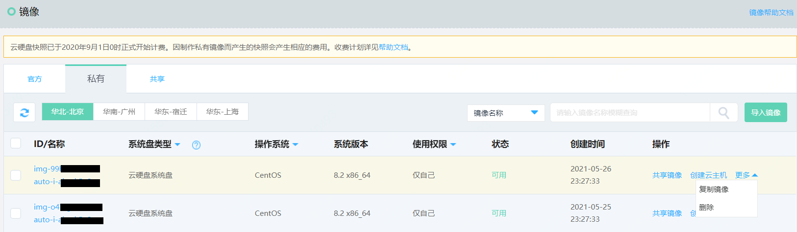
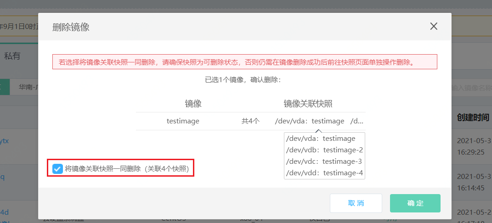

# 删除私有镜像
对于确定不再使用和保留的私有镜像，可通过此操作进行删除。

## 前提条件及限制
* 仅**可用**或**错误**状态的私有镜像支持删除；
* 已共享的私有镜像在取消共享关系前不可删除，如私有镜像已共享给其他用户，请取消共享后再进行删除；
* 本地系统盘镜像在有基于其创建的主机时，将无法删除（若镜像删除，在发生迁移或宿主机宕机等情况下将无法恢复数据），如因此限制导致镜像配额不足，请提交工单申请上调配额。

## 操作步骤
1、访问[镜像控制台][1]，或访问[京东云控制台](https://console.jdcloud.com/overview)点击顶部导航栏**弹性计算-云主机-镜像**进入镜像列表页。 
2、选择**私有镜像**TAB，找到要删除的私有镜像，在私有镜像列表**更多**操作中选择**删除**操作。

3、在确认删除弹出框中，点击**确认**，即可删除私有镜像。镜像删除时默认不删除关联快照，如期望一并删除，可勾选“将镜像关联快照一同删除”，系统会在镜像删除成功后尝试删除其原始关联快照，须注意的是，快照能否删除成功受其他因素影响（如是否存在共享关系，是否有其他关联镜像，是否有其他任务正在进行等），无论快照能否成功删除均不影响镜像本身删除。
		
>注意：
>* 镜像删除后，基于镜像创建的云主机（包括共享镜像后，其他用户创建的云主机）将无法通过重置系统功能初始化磁盘至此镜像的备份时间点。

4、私有镜像支持批量删除，可在列表页批量选择多个镜像后一同删除。

  [1]: https://cns-console.jdcloud.com/host/image/list
  [3]: ./images/Operation-Guide-Image-delete1.png "Operation-Guide-Image-delete1.png"
  [4]: ./images/Operation-Guide-Image-delete2.png "Operation-Guide-Image-delete2.png"

