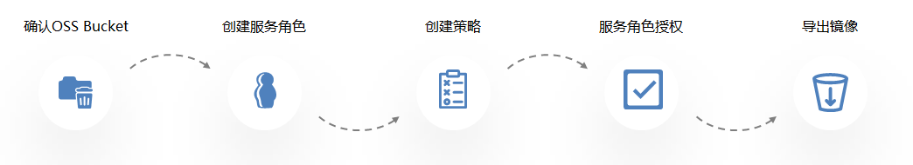
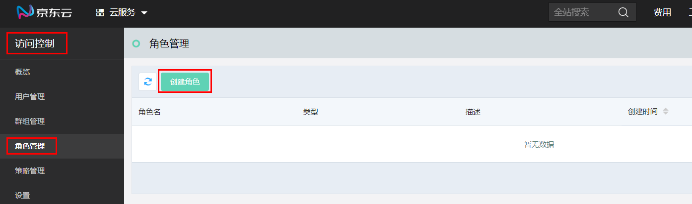
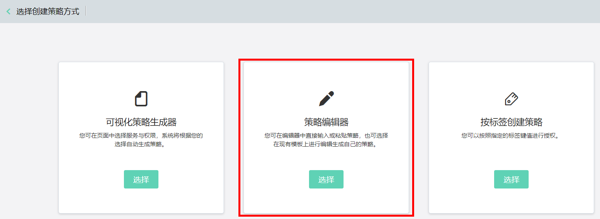
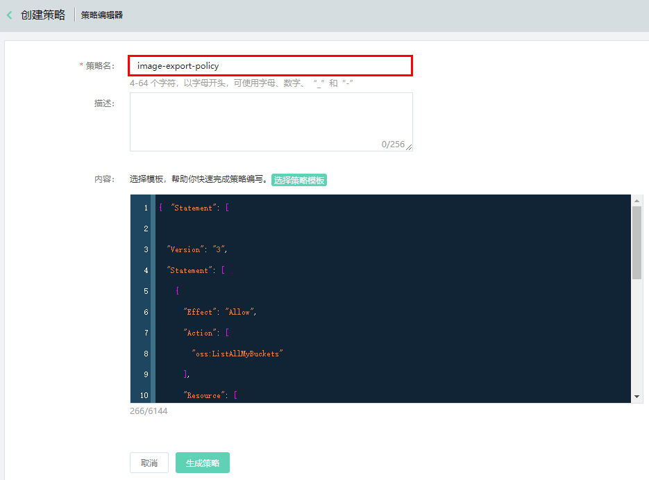
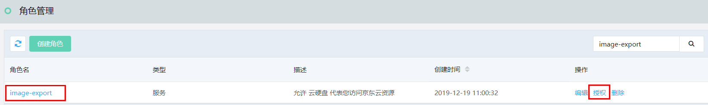
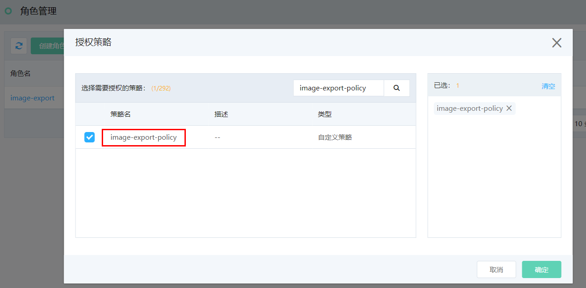
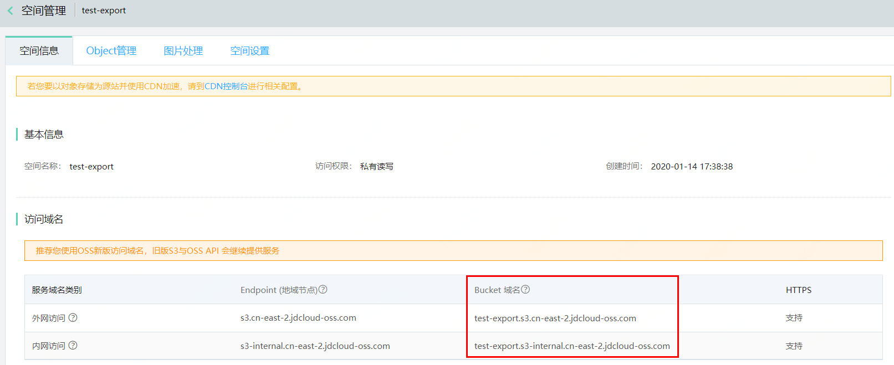

# 私有镜像导出

私有镜像导出，是指将您在京东智联云环境下制作的私有镜像，导出至同地域下的京东智联云对象存储空间中。导出之后，可随时下载镜像文件用作其他环境下的部署。

> 请注意：
<br>1. 仅支持系统盘镜像导出，即使镜像有关联的数据盘快照，也仅会导出系统盘镜像文件。<br>2. 导出的镜像文件格式为QCOW2。

## 前提条件与限制
### 服务角色要求
* 由于导出镜像需要对您的对象存储空间进行操作，因此需要您创建服务角色并授予系统相应的访问权限，请参照下方操作步骤中创建服务角色的说明进行创建。

### 镜像要求
* 镜像必须为**可用**状态，其他状态镜像无法导出；
* Windows Server操作系统的镜像不支持导出，若该镜像为您通过[导入镜像](Import-Private-Image.md)导入的私有镜像，则无此限制；
* 镜像必须为您的私有镜像，官方镜像、云市场镜像或其他人共享给您的镜像，即使有使用权限也无法直接导出原镜像；
* 镜像必须为**云硬盘系统盘**镜像，如您的镜像是**本地盘系统盘**镜像，可以通过[镜像类型转换](https://docs.jdcloud.com/cn/virtual-machines/convert-image)功能转换为**云硬盘系统盘**镜像后再导出。

### 对象存储要求
* 导出操作前，请确保已开通对象存储服务，并且在镜像**所属地域**下有可用的存储空间。

## 导出步骤



### 1. 确认对象存储空间<br>
镜像只能导出到同地域下OSS的Bucket中，因此如果有多个地域下的私有镜像需要导出，请确认各地域下均有可以存放镜像文件的Bucket（当前仅支持华东-上海地域）。<br>有关Bucket创建请参考：[创建存储空间](https://docs.jdcloud.com/cn/object-storage-service/create-bucket-2)。<br>

### 2. 创建服务角色<br>
访问 [角色管理控制台](https://iam-console.jdcloud.com/role/list)，或访问 [京东云控制台](https://console.jdcloud.com/overview) 依次点击顶部**云服务**菜单中的**管理-访问控制-角色管理**进入角色管理页面。<br>


点击**创建角色**，选择**服务角色**，在角色创建页面中，自定义服务角色名称，如：image-export，该角色名称需要在导出时作为必传参数提供。<br>在信任关系中选择**云硬盘**（云硬盘系统盘镜像本质是云硬盘快照，因此导出最终操作是由云硬盘服务代表您向对象存储写入镜像文件）。<br>


### 3、为服务角色创建策略<br>
访问 [策略管理控制台](https://iam-console.jdcloud.com/policy/list)，或访问 [京东云控制台](https://console.jdcloud.com/overview) 依次点击顶部**云服务**菜单中的**管理-访问控制-策略管理**进入策略管理页面。

点击**创建策略**，选择“策略编辑器，在策略创建页面中，自定义策略名称，如：```image-export-policy```。将下方JSON格式策略模板复制到内容输入区域。<br>
  
  

>注意：<br>
>1、将模板中```3241xxxx0385```替换为您的账号ID，账号ID在 [账户基本信息](https://uc.jdcloud.com/account/basic-info) 中查看;<br> 2、将模板中```image-export-bucket```替换为您期望存镜像文件的bucket名称，如有多个地域Bucket需要授权访问，可按此格式直接追加。
  
  
```JSON
{
  "Version": "3",
  "Statement": [
    {
      "Effect": "Allow",
      "Action": [
        "oss:ListAllMyBuckets"
      ],
      "Resource": [
        "*"
      ]
    },
    {
      "Effect": "Allow",
      "Action": [
        "oss:GetObject",
        "oss:AbortMultipartUpload",
        "oss:PutObject",
        "oss:ListMultipartUploadParts"
      ],
      "Resource": [
        "jrn:oss:*:3241xxxx0385:image-export-bucket/*"
      ]
    }
  ]
}
```

### 4、为服务角色授权策略<br>
返回角色管理列表，找到第2步中创建的服务角色```image-export```，点击操作中的**授权**。
  

在授权弹窗中查找并选中第3步中创建的策略“image-export-policy”，点击确定完成授权。可进入角色详情页确认授权是否成功。
  

>提示：如您希望仅在导出操作时才对系统服务进行授权，可以保留服务角色和策略，在每次导出前进行授权，导出完成后解除授权。
      
### 5、导出镜像
由于目前导出镜像功能未提供控制台操作入口，因此，完成以上几步操作后，请参照openAPI文档，使用CLI或SDK完成导入。<br>
导出任务提交成功后请记住接口返回的```exportTaskId```，以用于调用task查询接口获知导出进度。
* OpenAPI文档见：[镜像导出](https://docs.jdcloud.com/cn/virtual-machines/api/exportimage?content=API)<br>
* CLI安装和配置见：[CLI安装](https://docs.jdcloud.com/cn/cli/installation)   [CLI配置](https://docs.jdcloud.com/cn/cli/config) <br>
* CLI指令示意：

```
jdc vm export-image --region-id cn-east-2 --image-id img-xxxxxxx --role-name image-export --oss-url https://test-export.s3-internal.cn-east-2.jdcloud-oss.com --oss-prefix jdcloud
```

#### 接口参数说明：
参数中，ossUrl须填写OSS Bucket的完整**内网域名**(包含‘https://’)，如下图中的bucket，ossUrl请填写 'https://test-export.s3-internal.cn-east-2.jdcloud-oss.com' 。
  

| 参数                  | 类型      |是否必填     | 说明 |
| :------------------- |  :------------------- | :------------------- |:------------------- |
| roleName   | string    |是   |为导出镜像所创建的服务角色名称
| ossUrl   | string    |是   |用于存储镜像文件的，与镜像同地域的OSS Bucket的内网域名，请提供添加'https://' 后的完整URL
| ossPrefix   |  string    |否  |导出镜像文件的自定义前缀，如填写'123'，则导出镜像的Object名称为'123_exportImage\_\*img-xxxxxx\*'。支持大小写英文和数字，不超过32个字符。
| clientToken	 | string    | 否   | 用户导出镜像的幂等性保证。如传参值与某次的clientToken相同，则认为是同一个请求，将返回相同的请求结果。长度不能超过64个字符。

## 查看导出进度
成功提交导出镜像请求后，可通过镜像任务查询接口查看导出进展。
* OpenAPI文档见：[查询镜像任务](https://docs.jdcloud.com/cn/virtual-machines/api/imagetasks?content=API)<br>
* CLI指令示意：

```
jdc vm image-tasks --region-id cn-east-2 --task-action ExportImage --input-json '{"taskIds":[xxx]}'
```


## 相关参考
[导入镜像](Import-Private-Image.md)

[镜像类型转换](https://docs.jdcloud.com/cn/virtual-machines/convert-image)

[创建OSS存储空间](https://docs.jdcloud.com/cn/object-storage-service/create-bucket-2)

[服务角色](https://docs.jdcloud.com/cn/iam/role)

[镜像导出OpenAPI](https://docs.jdcloud.com/cn/virtual-machines/api/exportimage?content=API)

[查询镜像任务OpenAPI](https://docs.jdcloud.com/cn/virtual-machines/api/imagetasks?content=API)

[CLI安装](https://docs.jdcloud.com/cn/cli/installation)   

[CLI配置](https://docs.jdcloud.com/cn/cli/config)


