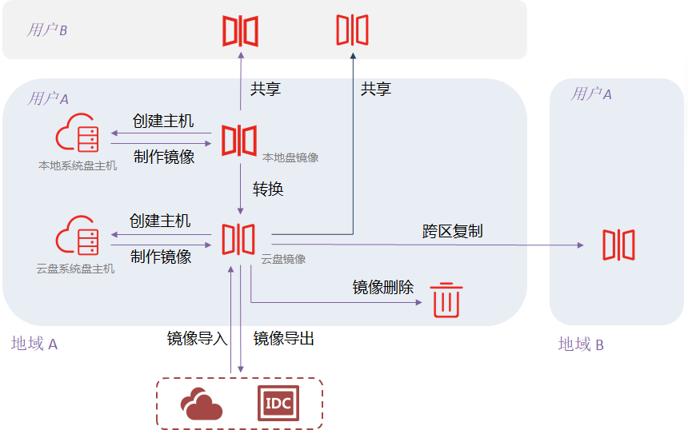

# 镜像概述

镜像是实例运行环境的模板，包含操作系统和预装的软件以及相关配置。镜像和实例密不可分，创建实例必须指定镜像，而实例创建后，可以通过制作镜像将系统盘和数据盘进行备份并记录其关联关系，后续可以基于镜像快速启动任意数量实例。

## 镜像应用
* 批量部署软件环境：
对已经部署好环境的实例制作镜像，然后基于此镜像批量创建实例，主机创建之后，拥有和之前实例一致的软件环境，以此可以达到批量部署软件环境的目的。

* 作为服务器运行环境的备份：
对一台实例制作镜像，如果该实例在后续使用过程中软件环境被损坏无法正常运行，则可以使用该镜像恢复受损的实例。

* 跨地域跨平台一致性部署
对实例制作镜像后，通过镜像导入/导出、跨区域复制等功能，可以实现本地+云或多云间的一致性部署，实现主备或多活架构。

## 镜像生命周期

