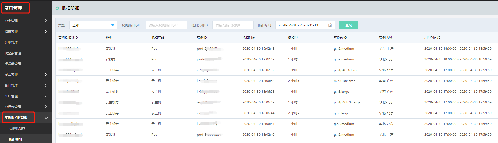
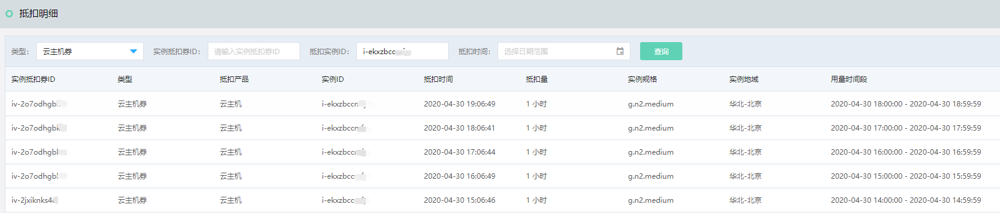

# 查看抵扣明细

购买实例抵扣券后，可随时查看实例抵扣券的抵扣情况，包括抵扣了哪些实例以及抵扣时长。

##  操作步骤

1、访问[费用管理-实例抵扣券管理控制台](https://ri.jdcloud.com/instances/list)，或在[京东云控制台](https://console.jdcloud.com/overview)点击顶栏**费用**下任意菜单进入费用管理控制台后点击左侧**实例抵扣券管理**。 

2、支持指定适用产品类型（云主机/容器/POD）后，以实例抵扣券ID、实例ID或抵扣时间区间查询抵扣情况。当您为同一个规格族购买多张实例抵扣券时，实例每次结算时可能使用不同的实例抵扣券进行抵扣。 
抵扣量以小时为单位，表示该实例在计费周期内有相当于多少运行时长的计算量被抵扣。

