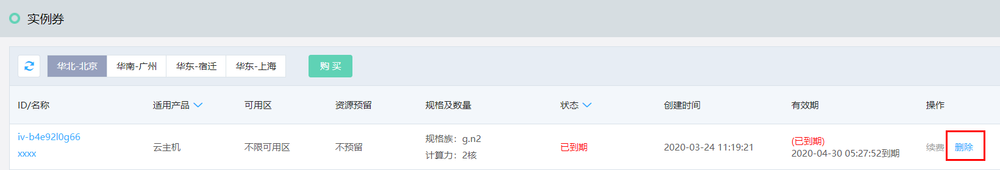

# 管理实例抵扣券

## 调配
（调整配置功能目前处于公测中，如需使用请联系客服申请开通） 

仅“可用”状态的实例抵扣券支持调整配置，如调整后价格高于调整前，则须补足差价；如调整后价格低于调整前，则延长抵扣券到期时间。
在实例抵扣券列表页选择资源，点击【调整配置】操作即可进入调配页面。
* 无资源预留型：支持调整规格族和计算力，不可变更地域和适用实例类型；
* 资源预留型：支持调整可用区、规格和数量，不可变更地域和适用实例类型。

## 续费
实例抵扣券过期后将立即失效，无法继续抵扣按配置计费实例的消耗，且不支持过期后操作续费。如确定继续使用请务必在过期前完成续费。 
在实例抵扣券列表页选择续费资源，点击【续费】操作即可进入续费页面完成续费操作。续费相关操作请参考：[续费管理](https://docs.jdcloud.com/online-buying/renew-management)。

## 删除
仅过期状态实例抵扣券支持删除，抵扣券到期后会自动失效，并释放所占用配额，但不会自动删除，如您确认无须保留购买记录可随时在控制台进行删除。

