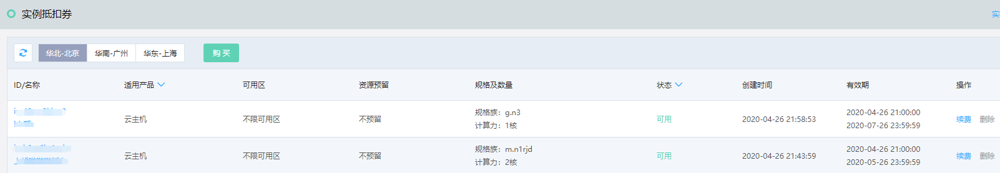
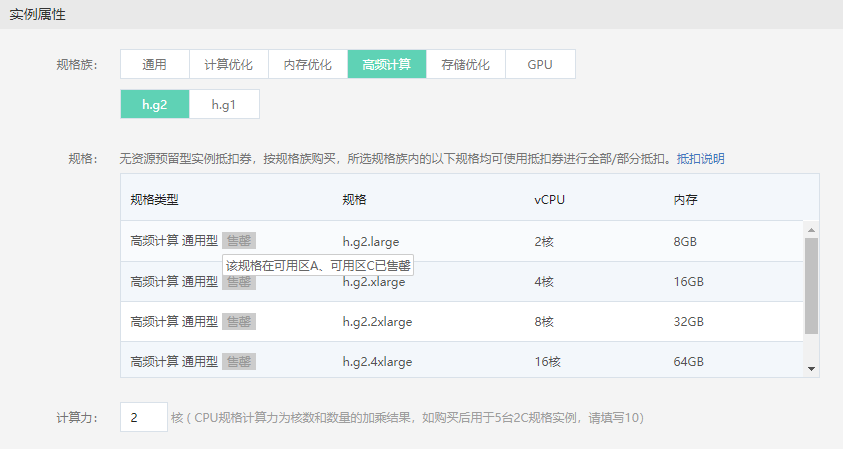
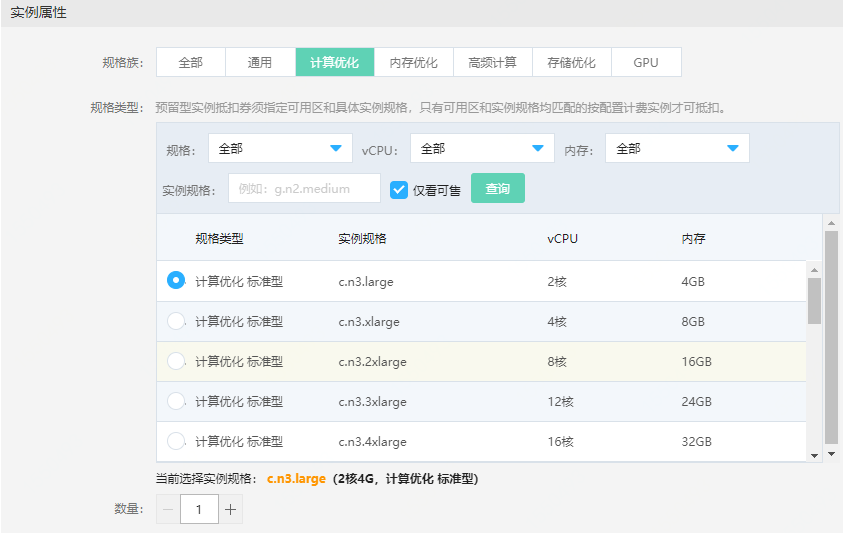
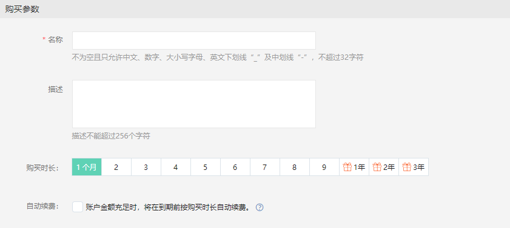

# 购买实例抵扣券 

实例抵扣券在**弹性计算-云主机**和**弹性计算-原生容器**菜单下均有控制台入口。您通过任意一个菜单入口均可以访问实例抵扣券页面，并在购买页按需购买不同类型的抵扣券。 

在购买前请根据计划购买资源情况确认当前地域下所购类型抵扣券配额是否充足，如不足请提交工单申请调整，默认配额如下：

<table>
	<thead>
   <tr>
      <th rowspan="2">  </td>
      <th colspan="2">非GPU规格</td>
      <th colspan="2">GPU规格</td>
   </tr>
   <tr>	   	   
      <td> 预留型</td>
      <td>无预留型</td>
      <td> 预留型</td>         
      <td>无预留型</td>
   </tr>
   	</thead>
   <tbody>    
   <tr>
      <td>云主机 </td>	   
      <td> 500计算力/地域</td>
      <td> 500计算力/地域</td>
      <td> 100计算力/地域</td>         
      <td> 100计算力/地域</td>
   </tr>
   <tr>
      <td>原生容器 </td>	   
      <td> 500计算力/地域</td>
      <td> 500计算力/地域</td>
      <td rowspan="2"> （暂无此类规格）</td>         
      <td rowspan="2"> （暂无此类规格）</td>
   </tr>	
   <tr>
      <td>POD </td>	   
      <td> 500计算力/地域</td>
      <td> 500计算力/地域</td>
   </tr>		
 </tbody>
 </table>   

>备注：
>* 非GPU规格：1计算力=1核
>* GPU规格：1计算力=1卡

## 操作步骤

1、访问[实例抵扣券控制台](https://cns-console.jdcloud.com/host/instancevoucher/list)，或在[京东云控制台](https://console.jdcloud.com/overview)点击左侧导航栏**弹性计算-云主机-实例抵扣券**或**弹性计算-原生容器-实例抵扣券**进入实例抵扣券列表页。 

2、地域与可用区选择 
* 地域：实例抵扣券不能跨地域使用且购买后无法修改地域属性，请根据实例地域分布情况选择抵扣券地域。 
* 资源预留：根据是否需要预留资源选择“无预留”或“有预留”。 
* 可用区：“无预留”型抵扣券仅需指定地域，所选地域下所有可用区的实例，如符合抵扣券抵扣要求，均可使用；“有预留”型抵扣券须指定具体可用区，仅所选可用区下且符合抵扣要求的实例才可使用。 
>预留型实例抵扣券当前为公测阶段，如需购买请提交工单申请。

3、适用产品选择 
提供云主机实例、容器实例、POD实例三种适用实例类型。 

4、实例属性配置 

#### 无预留型：
指定规格族、计算力购买。
* 规格族：无资源预留型实例抵扣券按规格族购买，请根据您已经创建或计划创建的按配置实例规格选择与其匹配的规格族。
* 规格：此处显示规格为当前所选规格族下所有支持抵扣的规格清单（**部分规格族下有个别规格不支持使用抵扣券，详见**[实例抵扣券抵扣规格说明](https://docs.jdcloud.com/virtual-machines/instancevoucher-overview#user-content-2)），如显示“售罄”说明该规格在当前地域下的部分/全部可用区存在售罄情况，如您计划购买抵扣券用于后续新建实例，请留意规格售罄情况，避免由于规格库存不足导致实例抵扣券购买后足量资源可抵扣，造成浪费。

>提示： 
>为避免实例抵扣券浪费情况，如您计划购买实例抵扣券用于新购资源，建议您先完成按配置计费实例的购买，根基实际购买资源情况，在实例第一次整点结算前完成实例抵扣券的购买。

* 计算力：
计算力= ∑规格尺寸×数量（规格尺寸是在同一规格族内衡量规格计算能力的依据，CPU规格通常等于核数，GPU规格通常等于GPU卡数），是反映单实例或多实例集群计算能力的指标。
   * CPU规格计算力为核数和数量的加乘结果，如购买后用于5台2C规格实例和2台4C规格实例，请填写(5×2)+(2×4)=18
   * GPU规格计算力为卡数和实例数量的加乘结果，如购买后用于5台4卡规格实例和2台2卡规格实例，请填写(5×4)+(2×2)=24

计算力输入范围：`[所选规格族最小可抵扣规格的规格尺寸,当前地域剩余配额]`，且仅支持输入所选规格族下最小规格规格尺寸（核数/卡数）的整数倍，如c.n3规格族下最小规格c.n3.large的规格尺寸为2，则所购计算力不能小于2且必须为2的整数倍。

#### 有预留型：
指定规格、数量购买。
* 规格族+规格：资源预留型实例抵扣券按规格，可根据规格族筛选出期望预留资源的实例规格，规格列表中可选规格即为购买时刻处于售卖状态的规格。
* 数量：期望预占指定规格的资源数量。数量输入范围:·[1,当前地域剩余配额]·，如云主机当前地域可用配额为500计算力（非GPU规格），则购买4核规格最多可输入数量125。

5. 购买参数配置： 
* 名称：名称不可为空，只支持中文、数字、大小写字母、英文下划线“ _ ”、中划线“ - ”及点“.”，且不能超过32个字符。 
* 描述：非必填，支持全字符，最多可输入256个字符。 
* 购买时长：购买时长支持1个月~9个月、1年、2年及3年。
* 自动续费：支持购买时直接配置自动续费，自动续费时长默认同购买时长，如后续需要调整可随时前往续费管理控制台调整。

## 相关参考
[实例抵扣券概述](https://docs.jdcloud.com/virtual-machines/instancevoucher-overview)

[实例抵扣券抵扣规格说明](https://docs.jdcloud.com/virtual-machines/instancevoucher-overview#user-content-2)
