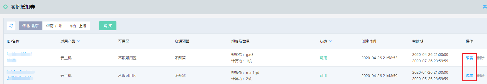
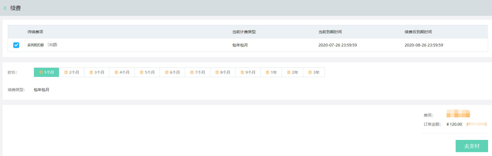

# 续费实例抵扣券

实例抵扣券到期前，可通过续费功能延长有效期。

## 前提条件及限制
* 仅**可用**状态下的实例抵扣券可以续费，一旦抵扣券过期将无法续费。

## 操作步骤
1、访问[实例抵扣券控制台](https://cns-console.jdcloud.com/host/instancevoucher/list)，或在[京东云控制台](https://console.jdcloud.com/overview)点击左侧导航栏**弹性计算-云主机-实例抵扣券**或**弹性计算-原生容器-实例抵扣券**进入实例抵扣券列表页。 

2、选择期望续费的实例抵扣券，点击操作中的**续费**。在续费页面中选择期望续费的时长，点击**去支付**完成付款后即可完续费。

