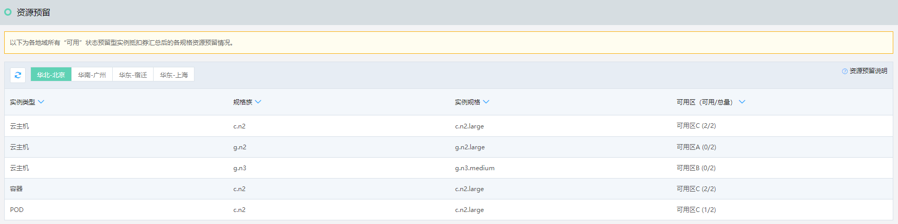

# 查看预留资源

## 资源预留说明

资源的占用有两种形式，一种是通过购买包年包月资源实现的，此方式下实例生命周期内资源始终处于占用状态；另一种则是通过购买预留型实例抵扣券来实现，此方式下会在资源池中为购券用户预留特定规格和数量的资源，用于用户创建按配置计费实例，这部分资源只有购券用户创建的实例才可以使用，且在预留期间内，无论用户何时删除实例，都可保证至少可以创建出与预留资源匹配的实例，因此此类资源称为“预留”。 

预留型实例抵扣券会根据抵扣券中指定的地域、可用区、规格和数量做相应的资源预留，且在预留时会优先预占已创建且与抵扣券匹配的实例，而在抵扣时也要求抵扣实例的属性与抵扣券完全一致，因此可以认为只有使用了预留资源（与预留资源匹配）的按配置计费实例才可以进行抵扣。 

>例： 
>北京C可用区下有A规格5个按配置计费实例，购买了一张C可用区10个A规格的预留型抵扣券，那么系统会先对已经创建的5个实例所用资源进行预留，随后在资源池中另行预留5个实例所需的资源。
    
    
## 操作步骤

1、访问[实例抵扣券控制台](https://cns-console.jdcloud.com/host/reservedresources/list)，或在[京东云控制台](https://console.jdcloud.com/overview)点击左侧导航栏**弹性计算-云主机-实例抵扣券-资源预留**或**弹性计算-原生容器-实例抵扣券-资源预留**进入实例抵扣券列表页。 

2、该页面提供了地域视角下的整体资源预留情况。如您账号下存在多张不同日期购买，规格和数量不尽相同的预留型实例抵扣券，系统会将所有未到期的抵扣券做实例类型、可用区、规格族和规格几个维度的汇总，以便以掌握预留资源的使用情况。 
（预留型实例抵扣券目前处于公测阶段，如需购买请联系客服开通权限） 

列表中的“总量”为所示属性下已预付费购买并实现预占的资源总数；“可用”为空闲的预占资源数量，即可直接使用预留资源创建&使用抵扣券抵扣费用的按配置计费资源数量。

	
>备注： 
>如果按配置计费的实例在停机时配置了“停机不计费”，由于停止后会释放资源，因此此类实例不会占用预留资源，比如北京C可用区下有5个A规格的安配置计费实例，且购买了一张与其完全匹配的预留型实例抵扣券，那么在实例运行时，可用/总量=0/5，而在实例停机不计费停止状态时，可用/总量=5/5。

